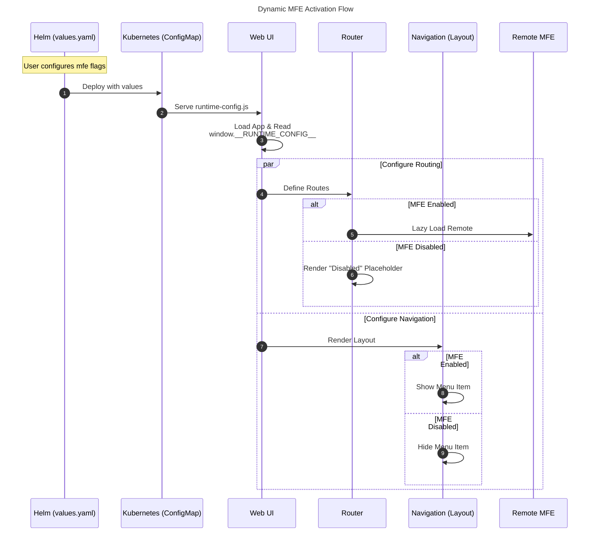

# Design Proposal: Dynamic UI MFE Activation

Author(s): UI Team

Last updated: 11/23/2025

## Abstract

Currently, the Edge Orchestrator UI loads all Micro-Frontends (MFEs) regardless of whether they are needed or enabled in a specific deployment. This proposal describes a mechanism to explicitly enable or disable specific MFEs (Infrastructure, Deployments, Cluster Orchestration, Admin) via configuration, making the UI dynamic and adaptable to different deployment scenarios.

## Proposal

The visibility and loading of different sections of the UI will be controlled by the `mfe` configuration in the Helm chart values.

The values defined in `values.yaml` are injected into the application at runtime via the `runtime-config.js` file. The UI shell (`root` app) reads these values during bootstrap and dynamically constructs the routing and navigation menu.

### Configuration

To change which components are active, the `mfe` section in `apps/root/deploy/values.yaml` (located in the `orch-ui` repository) is used:

```yaml
mfe:
  app_orch: true      # Controls "Deployments" tab
  infra: true         # Controls "Infrastructure" tab
  cluster_orch: true  # Controls Cluster Orchestration features
  admin: true         # Controls "Admin" features
```

> **Note**: Currently, this configuration is managed directly within the `orch-ui` repository. In the future, we plan to expose these controls through the Edge Manageability Framework (EMF) configuration, allowing for centralized management of UI capabilities alongside other platform settings.

### Effects

When an MFE is disabled via this configuration:
* **Navigation**: It will not appear in the main navigation menu.
* **Routing**: Its routes will be disabled. Accessing the URL directly (e.g., `/applications/deployments`) will show a "disabled" message instead of the application.
* **Performance**: The application code for that MFE will not be loaded (lazy loading), reducing the initial bundle size and load time.

### Flow Diagram



## Limitations

* **Deployment Required**: Changing the enabled/disabled state of an MFE is a deployment-time configuration. It requires a re-deployment to update the ConfigMap and restart the UI pod. It is not a user-facing toggle that can be changed at runtime without a restart.
