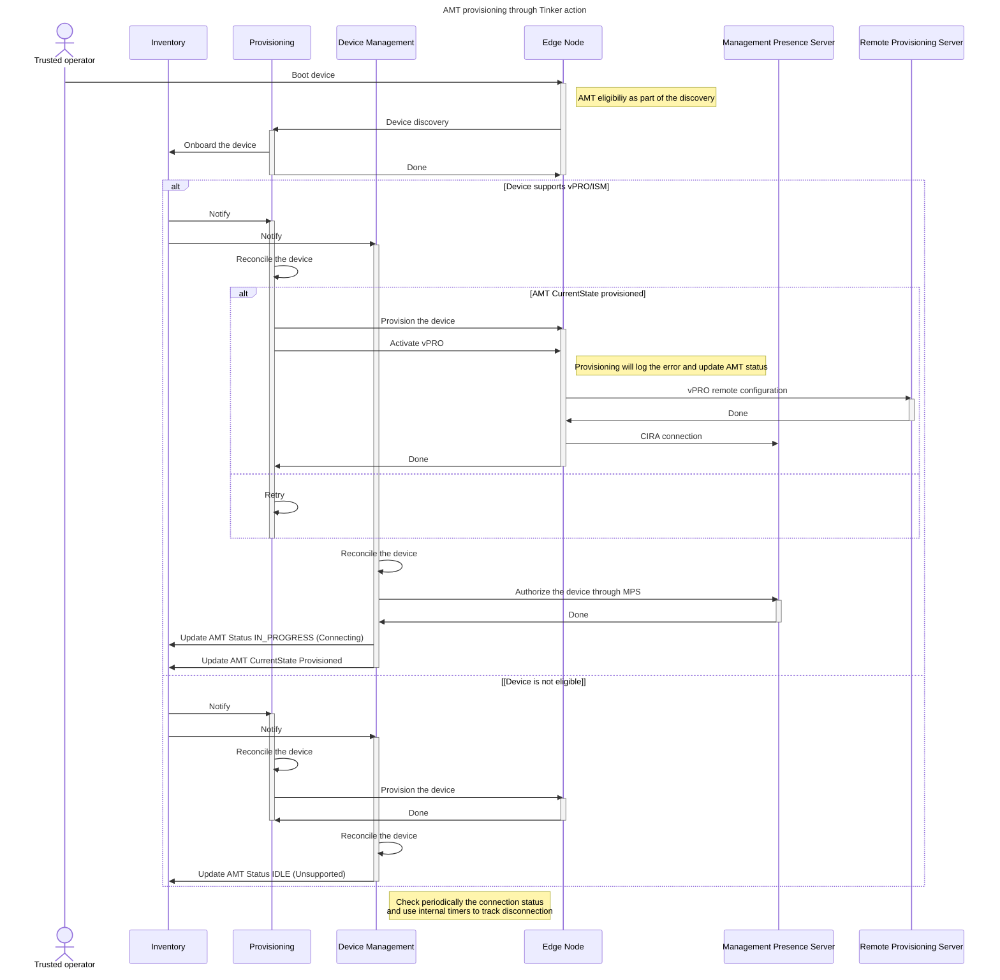

# Design Proposal: vPRO/AMT/ISM devices activation

Author(s): Edge Infrastructure Manager Team

Last updated: 05/12/2025

## Abstract

vPRO/Active Management Technology (AMT)/Intel Standard Manageability (ISM) needs to be explicitily activated and
configured in the devices before to be consumable from a cloud deployment.

[Open Device Management Toolkit](https://device-management-toolkit.github.io/docs/2.27/GetStarted/overview/) (Open DMT)
provides an open source stack through which is possible to manage vPRO enabled devices.

This document describes the design proposal for adding the Remote Provisioning Client (RPC) component of DMT stack into
the EN sw and propose a design on how to manage the device activation during the EN journey.

## Proposal

Remote Provisioning Client (RPC) is launched during the provisioning flow (uOS stage).

vPRO (AMT & ISM) capable Core devices need to have the `rpc-go` utility embedded in the uOS image (the so called
Tink-EMT image - replacement of HookOS), as this is required to activate AMT. This also requires the `heci` driver to
be included in the kernel as the `rpc-go` utility communicates with CSME over PCIe/HECI in to activate the device.

`Local Manageability Service` (LMS) must to be included as it is still required to enable the communication between RPC
and AMT device. Additionally, it offers the support for in-band commands too.

Adding the `rpc-go` to the Tink-EMT image allows for the AMT/ISM device to be activated independently of the target
operating system being deployed on the edge node. Not every device will support AMT & ISM. Introspection of the device
capabilites will be added to the `Device Discovery` to determine:

1. vPRO Supported Device
2. ISM Supported Device
3. No OOB Supported

This will also allow for a custom workflows in Tinkerbell to be used based on whether the device support AMT or ISM.

If an attempt is made to activate an unsupported or faulty device, the `rpc-go` client will yield an error. The
tinkerbell workflow should appropriately be handling the common error scenarios, please refer to the official
[DMT/rpc-go documentation](https://device-management-toolkit.github.io/docs/2.27/Reference/RPC/libraryRPC/#rpc-error-code-charts)

Let us now analyze the device activation, the user must do the following steps before starting AMT activation

- AMT is enabled in BIOS
- PKI DNS domain in BIOS matches domain in pfx certificate
- AMT is unprovisioned before starting the provisioning
- MEBx has been set either to default or pre-provisioned by OXM

**Note1** - MPS requires the creation of a device before accepting CIRA connections which is part of the 2-way auth
implemented between MPS and AMT;

**Note 2** - Device Management Resource Manager will provide a `staticPassword` profile where the AMT and MEBx
passwords are set to a well know value. Disabling this option the RM will randomly generate a password for each device.

**Note 3** - Passwords are stored in `Vault` and can be always retrieved either using the Vault APIs or through the
web-ui.

### MVP Requirements

At the time of writing it is expected to support the following User flows:

- User is able to verify if vPRO/ISM is supported or no;
- User is able to configure the activation of Edge Node for vPro;
- User is able to recover the device if something goes wrong during the provisioning of the final OS;

It must be carefully considered the impact on the KPIs as the User will experience worse performance when asking the
activation of Device Management feature.

However, such flow is considered not mandatory and this penalty might be accepted by the user to have in exchange extra
manageability features.

## Rationale

Alternative solutions have been carefully considered and will be taken into account in future releases, in particular:

- **Late Binding** where RPC is integrated in the image of the final OS. If this on one side, addresses the need to
support remote deactivation and day2 reconfiguration, it does not provide a solution to recover the device if something
goes wrong during the provisioning flow and require the integration with a **Platform Manageability Agent**.
- **Cloud-Init** provisioning where AMT is activated at the end of the provisioning flow. This solution does not offer
better integrations compared to the others and has the inherent disadvantage of not supporting feedback to the
provisioning system that becomes completely blind on the result of the activation

Both solutions provide a seamless integration of the EMT-Standalone devices. However, the first solution is considered
more flexible and provide better control compared to the second solution.

## Affected components and Teams

We report hereafter the affected components and Teams:

- Onboarding Manager and Tinker Actions (EIM team)
- EMT and EMT-Tinker (EMT team)

## Implementation plan

Hereafter we present as steps the proposed plan to manage the device activation in the release 3.1. EIM team will
implement the following functionality to support this design proposal:

- Device discovery reports device eligibility
- Activation will be always performed without user consent
- EMF EN will be activated during the provisionig flow through a custom Tinker action
- Ignition of the Platform Manageability Agent and definition of the SB gRPC APIs of the DM Resource Manager

As dependency we expect the EMT team to deliver:

- EMT-Tinker image supporting RPC-go, LMS, kernel drivers and all the dependencies;

**Not mandatory but nice to have** is to support the installation of the RPC and its dependencies in all the Ubuntu
flavors support by the Edge Orchestrator and have EMT image supporting RPC and its dependencies;

### Test Plan

To ensure the reliability and functionality of the EIM components, it is crucial to component testing in isolation and
by mocking DMT and other deps. **Unit tests** will be extended accordingly in the affected components.

The integration plan will be split in two flows: i) VIP tests will be extended to verify e2e flow except successfull
activation which cannot be tested using any Virtual Edge Node flavor; ii) New tests involving hardvware devices will be
written to verify the complete e2e flow.

All the aforementioned tests should include negative and failure scenarios such as failed activations, unsupported
operations.

We expect EMT team to conduct integration tests before releasing EMT images supporting RPC and its deps.

## Open issues (if applicable)

Platform Manageability Agent and SB APIs will not be integrated which implies that the remote deactivation and device
reconfiguration will not be supported in 3.1.
