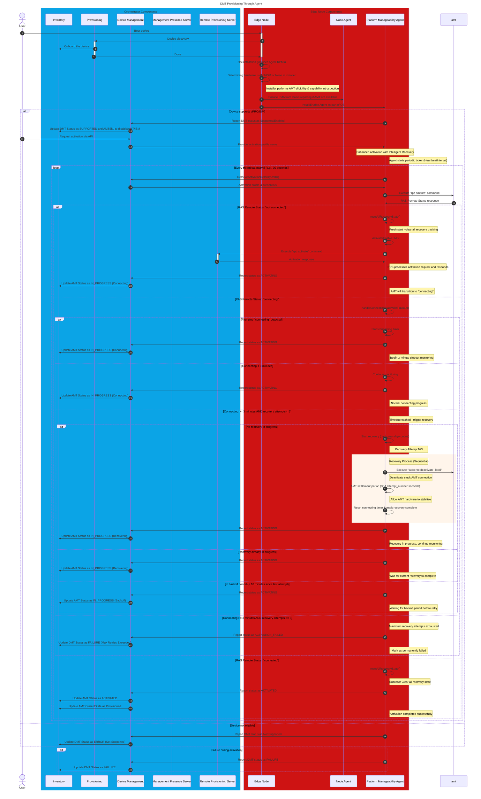

```mermaid
sequenceDiagram
    autonumber
    title DMT Provisioning Through Agent

    actor us as User

    box rgba(11, 164, 230, 1) Orchestrator Components
        participant inv as Inventory
        participant ps as Provisioning
        participant dm as Device Management
        participant mps as Management Presence Server
        participant rps as Remote Provisioning Server
    end

    box rgba(206, 19, 19, 1) Edge Node Components
        participant en as Edge Node
        participant nagent as Node Agent
        participant agent as Platform Manageability Agent
    end

    us ->> en: Boot device
    activate en
    en ->> ps:  Device discovery
    activate ps
    ps ->> inv:  Onboard the device
    ps ->> en:  Done
    deactivate ps
    deactivate en

    en ->> en:  OS installation (includes Agent RPMs)
    en ->> en: Determining hardware is AMT/ISM or None in installer
    Note right of en: Installer performs AMT eligibility & capability introspection
    en ->> nagent:  Exclude PMA from status reporting if AMT not available
    en ->> agent:  Install/Enable Agent as part of OS

    alt Device supports vPRO/ISM
        agent ->> dm:  Report DMT status as Supported/Enabled
        dm ->> inv:  Update DMT Status as SUPPORTED and AMTSku to disable/AMT/ISM

        us ->> dm:  Request activation via API
        dm ->> agent:  Provide activation profile name

        Note over agent: Enhanced Activation with Intelligent Recovery
        Note right of agent: Agent starts periodic ticker (HeartbeatInterval)

        loop Every HeartbeatInterval (e.g., 30 seconds)
            agent ->> dm: RetrieveActivationDetails(hostID)
            dm ->> agent: Activation profile & credentials
            
            agent ->> amt: Execute "rpc amtinfo" command
            amt ->> agent: RAS Remote Status response
            
            alt RAS Remote Status: "not connected"
                agent ->> agent: resetAllRecoveryState()
                Note right of agent: Fresh start - clear all recovery tracking
                
                agent ->> agent: Activate/Enable LMS
                agent ->> rps: Execute "rpc activate" command
                activate rps
                rps ->> agent: Activation response
                deactivate rps
                Note right of agent: RPS processes activation request and responds
                
                agent ->> dm: Report status as ACTIVATING
                dm ->> inv: Update AMT Status as IN_PROGRESS (Connecting)
                Note right of agent: AMT will transition to "connecting"
                
            else RAS Remote Status: "connecting"
                agent ->> agent: handleConnectingStateWithTimeout()
                
                alt First time "connecting" detected
                    agent ->> agent: Start connecting timer
                    agent ->> dm: Report status as ACTIVATING
                    dm ->> inv: Update AMT Status as IN_PROGRESS (Connecting)
                    Note right of agent: Begin 3-minute timeout monitoring
                    
                else Connecting < 3 minutes
                    agent ->> agent: Continue monitoring
                    agent ->> dm: Report status as ACTIVATING
                    dm ->> inv: Update AMT Status as IN_PROGRESS (Connecting)
                    Note right of agent: Normal connecting progress
                    
                else Connecting >= 3 minutes AND recovery attempts < 3
                    Note right of agent: Timeout reached - trigger recovery
                    
                    alt No recovery in progress
                        agent ->> agent: Start recovery (background goroutine)
                        Note right of agent: Recovery Attempt N/3
                        
                        rect rgb(255, 245, 235)
                            Note right of agent: Recovery Process (Sequential)
                            agent ->> amt: Execute "sudo rpc deactivate -local"
                            Note right of agent: Deactivate stuck AMT connection
                            agent ->> agent: AMT settlement period (30 * attempt_number seconds)
                            Note right of agent: Allow AMT hardware to stabilize
                            agent ->> agent: Reset connecting timer & mark recovery complete
                        end
                        
                        agent ->> dm: Report status as ACTIVATING
                        dm ->> inv: Update AMT Status as IN_PROGRESS (Recovering)
                        Note right of agent: Recovery in progress, continue monitoring
                        
                    else Recovery already in progress
                        agent ->> dm: Report status as ACTIVATING
                        dm ->> inv: Update AMT Status as IN_PROGRESS (Recovering)
                        Note right of agent: Wait for current recovery to complete
                        
                    else In backoff period (< 10 minutes since last attempt)
                        agent ->> dm: Report status as ACTIVATING
                        dm ->> inv: Update AMT Status as IN_PROGRESS (Backoff)
                        Note right of agent: Waiting for backoff period before retry
                    end
                    
                else Connecting >= 3 minutes AND recovery attempts >= 3
                    Note right of agent: Maximum recovery attempts exhausted
                    agent ->> dm: Report status as ACTIVATION_FAILED
                    dm ->> inv: Update DMT Status as FAILURE (Max Retries Exceeded)
                    Note right of agent: Mark as permanently failed
                end
                
            else RAS Remote Status: "connected"
                agent ->> agent: resetAllRecoveryState()
                Note right of agent: Success! Clear all recovery state
                agent ->> dm: Report status as ACTIVATED
                dm ->> inv: Update AMT Status as ACTIVATED
                dm ->> inv: Update AMT CurrentState as Provisioned
                Note right of agent: Activation completed successfully
            end
        end
    else Device not eligible
        agent ->> dm:  Report DMT status as Not Supported
        dm ->> inv:  Update DMT Status as ERROR (Not Supported)
    end

    alt Failure during activation
        agent ->> dm:  Report DMT status as FAILURE
        dm ->> inv:  Update DMT Status as FAILURE
    end
```