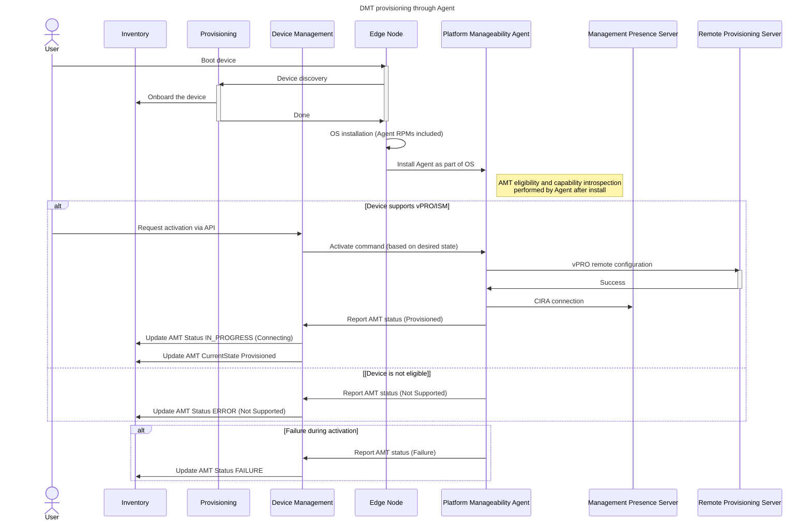

# Design Proposal: vPRO/AMT/ISM devices activation

Author(s): Edge Infrastructure Manager Team

Last updated: 06/20/2025

## Abstract

vPRO/Active Management Technology (AMT)/Intel Standard Manageability (ISM) needs to be explicitily activated and
configured in the devices before to be consumable from a cloud deployment.

[Open Device Management Toolkit](https://device-management-toolkit.github.io/docs/2.27/GetStarted/overview/) (Open DMT)
provides an open source stack through which is possible to manage vPRO enabled devices.

This document describes the design proposal for adding the Remote Provisioning Client (RPC) component of DMT stack into
the EN sw and propose a solution on how to manage the device activation during the EN journey.

## Proposal

Remote Provisioning Client (RPC) is integrated as part of Platform Manageability Agent, which operates within the final operating system environment. 

The Platform Manageability Agent which includes RPC, will be provided as RPM packages. These RPMs will be included in the OS image, enabling the agent binaries to be installed automatically during the OS installation process. This ensures that all required manageability features are available as soon as the OS is deployed.

Upon installation, the Platform Manageability Agent performs AMT eligibility and capability detection on the Edge Node and reports the findings to the Device Management Resource Manager. The agent comes bundled with the `rpc-go` utility and necessary drivers (including heci) to enable communication with CSME over PCIe/HECI. Based on the capability detection results, the agent either enables DMT activation features for vPRO/AMT/ISM capable devices or reports an error status for non-capable devices.

`Local Manageability Service` (LMS) must be included as it is still required to enable the communication between RPC and AMT device. Additionally, it offers the support for in-band commands too.

In cases where activation is attempted on unsupported or faulty devices, the agent will report errors to Device Management.

[DMT/rpc-go documentation](https://device-management-toolkit.github.io/docs/2.27/Reference/RPC/libraryRPC/#rpc-error-code-charts)

Let us now analyze the device activation, the user must do the following steps before starting AMT activation

- AMT is enabled in BIOS
- PKI DNS domain in BIOS matches domain in pfx certificate
- AMT is unprovisioned before starting the provisioning
- MEBx has been set either to default or pre-provisioned by OXM

**Note 1** - The user interacts with the Device Management API, and the Device Management Resource Manager instructs the agent to perform activation/deactivation based on desired states.

**Note 2** - MPS requires the creation of a device before accepting CIRA connections which is part of the 2-way auth
implemented between MPS and AMT;

**Note 3** - Device Management Resource Manager will provide a `staticPassword` profile where the AMT and MEBx
passwords are set to a well know value. Disabling this option the RM will randomly generate a password for each device
(using RPS auto-generation) or it will generate a random password and store as secret.

**Note 4** - Passwords are stored in `Vault` and can be always retrieved either using the Vault APIs or through the
web-ui.

**Note 5** - When a device does not support vPRO/ISM capabilities, this is treated as an error condition that needs to be surfaced to the user. The UX team will determine the best way to present this information to users.

### MVP Requirements

At the time of writing it is expected to support the following User flows:

- User is able to verify if vPRO/ISM is supported or no;
- User is able to configure the activation of Edge Node for vPro;
- User is able to recover the device if something goes wrong during the provisioning of the final OS;

It must be carefully considered the impact on the KPIs as the User will experience worse performance when asking the
activation of Device Management feature.

However, such flow is considered not mandatory and this penalty might be accepted by the user to have in exchange extra
manageability features.

## Affected components and Teams

We report hereafter the affected components and Teams:

- Onboarding Manager and Tinker Actions (Edge Infrastructure Manager team)

## Implementation plan

Hereafter we present as steps the proposed plan to manage the device activation in the release 3.1. Edge Infrastructure
manager will implement the following functionality to support this design proposal:

After provisioning is complete and the final OS is deployed, the Platform Manageability Agent will be installed and initialized as part of the OS. This includes RPC, LMS and exposing the SB gRPC APIs of the Device Management Resource Manager.

### Test Plan

To ensure the reliability and functionality of the Edge Infrastructure Manager components, it is crucial to component
testing in isolation and by mocking DMT and other deps. **Unit tests** will be extended accordingly in the affected
components.

The integration plan will be split in two flows: i) VIP tests will be extended to verify e2e flow except successfull
activation which cannot be tested using any Virtual Edge Node flavor; ii) New tests involving hardvware devices will be
written to verify the complete e2e flow.

All the aforementioned tests should include negative and failure scenarios such as failed activations, unsupported
operations.

We expect EMT team to conduct integration tests before releasing EMT images supporting RPC and its deps.

## Open issues (if applicable)

Platform Manageability Agent and SB APIs will not be integrated which implies that the device reconfiguration will not
be supported in 3.1.
