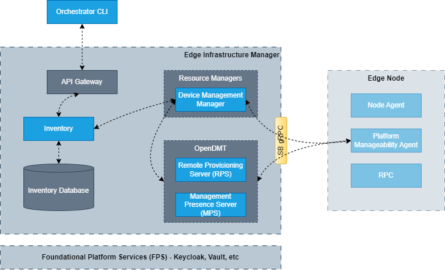
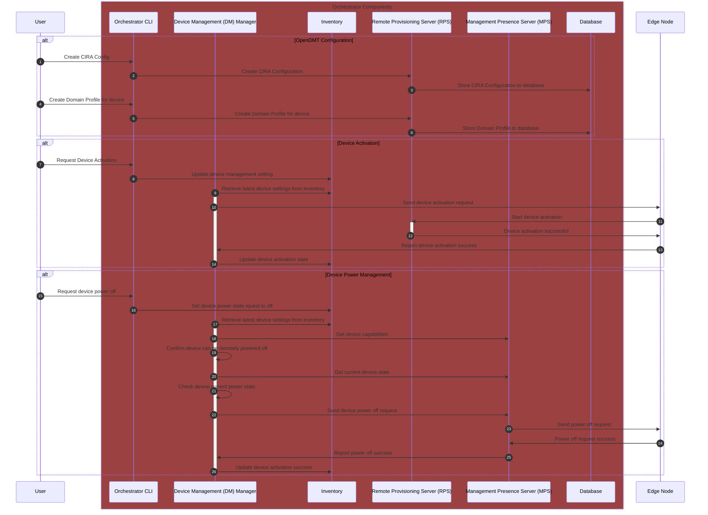
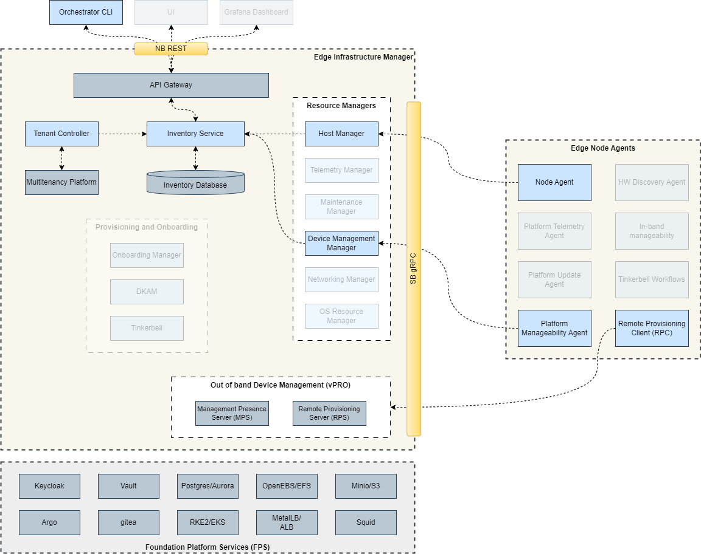
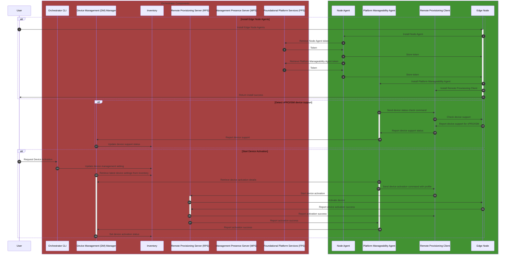

## Design Proposal: Out-of-band Device Management Service Decomposition

Author(s): Edge Infrastructure Manager Team

Last Updated: 2025-11-07

## Abstract

As part of the Edge Infrastructure Manager (EIM) included in the Edge Manageability Framework (EMF) full stack deployment,
it deploys a device management workflow. This workflow is used to support out-of-band device management for edge nodes
connected to the Orchestrator for those devices that can support vPRO/Active Management Technology (AMT)/Intel Standard
Manageability (ISM). It does this using the components included in the [Open Device Management Toolkit (OpenDMT)](https://device-management-toolkit.github.io/docs/2.28/)
release. Currently, this workflow cannot be deployed on it own, instead the whole EIM needs to deployed in order to be able
to use out-of-band device management. This proposal outlines how the current workflow integrated into EIM can be separated
into its own modular workflow that can be deployed independently of the rest of the EIM services using just the shared
foundational services of the EMF stack. It will also cover how such a modular workflow can be deployed in an environment
where, instead of the EMF foundational services being avaiable, a different infrastructure stack is used to suport the workflow.

## Background

The current out-of-band implementation uses three of the OpenDMT services, the [Management Presence Server](https://device-management-toolkit.github.io/docs/2.28/Reference/MPS/configuration/) and the
[Remote Provisioning Server](https://device-management-toolkit.github.io/docs/2.28/Reference/RPS/configuration/), as well
as a [Device Management (DM) Manager](https://github.com/open-edge-platform/infra-external/tree/main/dm-manager) in the
Orchestrator to manage the device activation and power for all connected edge node devices. On each Edge Node, the
[Platform Manageability Agent](https://github.com/open-edge-platform/edge-node-agents/tree/main/platform-manageability-agent)
communicates with the DM manager and triggers the
[Remote Provisioning Client](https://device-management-toolkit.github.io/docs/2.28/Reference/RPC/buildRPC_Manual/) on the
edge node to update the device settings based on the DM Manager response. For more details on the out-of-band device
management workflow, see the [vPRO Devices Activation Documentation](./vpro-device.md).

Since this workflow requires the inventory to track edge nodes and devices as well as some of the foundational platform
services of the EMF stack, such as authentication, multitenancy and storage, in order to use the out-of-band device
management the entire EIM, with all services, must be deployed. This means that, if only the out-of-band device management
is needed, there are a number of services deployed that are not required for the use case.

As outlined in the [EIM Modular Decomposition proposal](./eim-modular-decomposition.md), by decoupling individual use case
workflows currently in the EIM so that they can be deployed into an Orchestrator environment without requiring the other
EIM services to also be deployed. The out-of-band device management use case is one of these use cases that will be
decomposed from the EIM stack into a modular workflow. To do this, the EIM services related to this use case will be
combined into an out-of-band device management installation package that can be installed onto an Orchestrator that contains
only the required foundational services needed by the workflow. For the Edge Node agents and services needed for this use
case, the same will also be done for these.

## Proposal

### Scope

- This proposal will only cover the EIM and Edge Node agents and services used in the current out-of-band device management
  workflow.
- Proposal only covers how the workflow will run and outlines how it will differ from the current workflow in order to
  support modular workflows, it will not cover packaging and installation of modular workflows. For details on how
  packaging and installation of such modular workflows will be hanldled, please see the
  [Modular Packaging and Installer Design Proposal](./eim-modular-decomposition-installer.md).
- Changes outlined below are designed to work in both Track 1 and Track 2 use case outlined in the
  [EIM Modular Decomposition proposal](./eim-modular-decomposition.md).

### Architectural Design

#### EIM Service Design

The current design of the EIM services used in out-of-band device management are outlined in the
[vPRO design documentation](./vpro-device.md) and will remain the same in the most part when moved to a modular use case.
For example, the current device activation and power management flows, which will remain the same, however abstraction will
be added for the APIs used by the DM Manager and Inventory services on the Orchestrator to allow them to be plugged into both
the EMF foundational services as well as a customer's own infrastructure if needed.

In the modular use case, the creation of device profiles and communication between the out-of-band device management serivces
on the Orchestrator and the agents on the Edge Node will remain the same before. Using the [Orchestrator CLI](orch-cli.md),
a user will be able to create the domain profile for a device and add it to the database so it can be retrieved when the
RPC binary on the Edge Node communicates with the RPS service to register and activate the device.

#### Edge Node Agent Design

For the edge node agents, there will need to be some changes needed to the Platform Manageability Agent (PMA) as well as the
Node Agent (NA) to install and configure them to work in a modular use case deployment. Currently, the NA requires connects
to the Vault and Keycloak services in the EMF to retrieve tokens for each agent on the edge node as well as the Host Resource
Manager (HRM). In a modular deployment, the underlying infrastructure being used to provide such tokens to enable
authenticated connections with the Orchestrator may be different, while the HRM may not be deployed with EIM services for
the NA to connect to. If that is the case, then the NA will need to be able to connect to whichever identity management
infrastructure is in use on the Orchestrator, either EMF or customer infrastructure, and determine whether the HRM has been
deployed as well. This will require updates to the NA configuration file used on start up to provide the required
Orchestration information needed by the agent as well as updates to how the NA runs so that it can skip section that may
not be needed for modular use case.

Since the out-of-band use case will be required to run in environments where the full EMF stack has not been deployed, the
detection of vPRO supporting devices will also need to be modified. When deploying the full EMF stack, both the cloud-init
and installer scripts used for provisioning and onboarding edge nodes to an Orcehstrator will check for vPRO or ISM support
on the edge node. However, in a modular deployment of the out-of-band device management workflow, these components will not
be included and may not have been installed under a separate workflow. Therefore, the PMA will need to be updated to detect
support for vPRO or ISM and operate accordingly.

Below is the modular workflow for the PMA and NA once installed onto an edge node. This flow is similar to the agent install
and agent operation outlined in the [vPRO Device Activation](./vpro-device.md) documentation with the vPRO/ISM support
detection moved to the PMA.

## Open Issues

- Will the Host Resource Manager service always be deployed with the EIM services regardless of the use case?
