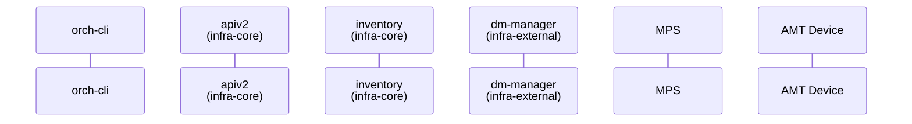

# Design Proposal: Remote KVM Operations via orch-cli

Author(s): Edge Infrastructure Manager Team

Last updated: 11/11/2025

## Abstract

Remote KVM (Keyboard-Video-Mouse) enables administrators to remotely view
and control the display and input devices of Intel AMT-enabled edge nodes.
This capability is essential for out-of-band troubleshooting, recovery
operations, and system management when SSH or other in-band access methods
are unavailable.

This document describes the design proposal for integrating remote KVM
operations into the Edge Manageability Framework/vPRO through orch-cli or
web ui. The implementation leverages existing MPS infrastructure and
maintains full multi-tenancy support.

**Note:** This proposal focuses on KVM session initiation and management
through orch-cli. The underlying KVM redirection capability is already
provided by MPS and Intel AMT, requiring only the addition of an
authorization and session management layer.

## Proposal

### KVM Operation Flow

Remote KVM operations follow the desired/current state reconciliation. When a
user requests KVM access through orch-cli, the system updates the host's
`desiredKvmState` field, triggering the dm-manager reconciler to establish a
session with MPS and return connection details.

The following diagram illustrates the KVM session establishment flow:

### KVM Session Flow

TBD



### KVM Session States

The KVM state machine:

| State | Description |
|-------|-------------|
| `KVM_STATE_IDLE` | No active session, default state |
| `KVM_STATE_REQUESTED` | User requested KVM access (desired state) |
| `KVM_STATE_ACTIVE` | Session established with valid token |
| `KVM_STATE_STOPPED` | User requested session termination |
| `KVM_STATE_ERROR` | Error occurred during session establishment |

### orch-cli Commands

**Command structure**:

- `set host <host-id> --kvm start`: Requests KVM session by setting
  desiredKvmState to KVM_STATE_REQUESTED
- `set host <host-id> --kvm stop`: Terminates KVM session by setting
  desiredKvmState to KVM_STATE_STOPPED
- `get host <host-id>`: Query current KVM state and session details
- Uses standard flags: `--project`, `--api-endpoint`

#### 1. Start KVM Session

```bash
# First, authenticate with Keycloak 
orch-cli login <keycloakuser> <userpassword> \
  --keycloak https://api.${CLUSTER}/realms/master

# Start KVM session 
orch-cli set host <host-resource-id> --project <project name> \
  --api-endpoint "https://api.${CLUSTER}" \
  --kvm start
```

**Output**:

```text
KVM Session Requested:
  Host: <host-resource-id>
  Session URL: wss://mps.${CLUSTER}/kvm/<session-id>
  Expires:
  
Open the URL in a browser to access the KVM console.
```

#### 2. Stop KVM Session

```bash
# Stop active KVM session 
orch-cli set host <host-resource-id> --project <project name> \
  --api-endpoint "https://api.${CLUSTER}" \
  --kvm stop
```

**Output**:

```text
KVM Session Stopped:
  Host: <host-resource-id>
  Status: Session terminated
```

#### 3. Check KVM Status

```bash
# Query current KVM state 
orch-cli get host <host-resource-id> --project <project name> \
  --api-endpoint "https://api.${CLUSTER}"
```

**Output**:

```json
{
  "host_id": "abc-123",
  "desired_state": "KVM_STATE_ACTIVE",
  "current_state": "KVM_STATE_ACTIVE",
  "kvm_url": "wss://",
  "session_token": "",
  "last_updated": ""
}
```

**Note**: KVM desired/current state:

- `desiredKvmState`: KVM_STATE_REQUESTED, KVM_STATE_STOPPED
- `currentKvmState`: KVM_STATE_IDLE, KVM_STATE_ACTIVE, KVM_STATE_ERROR

**Authentication Requirements**:

- Keycloak JWT token obtained via `orch-cli login` and stored for
  subsequent commands
- User must belong to tenant that owns the project
- User must have appropriate RBAC permissions for host management

### Component Architecture

The KVM operation involves the following EMF components:

- **infra-core/apiv2**: REST API layer that handles host resource PATCH
  requests with KVM state changes
- **infra-core/inventory**: PostgreSQL database storing host resources
  including KVM state fields
- **infra-external/dm-manager**: Reconciler service that detects KVM state
  mismatches and orchestrates MPS calls
- **mps**: Management Presence Server that generates KVM authorization
  tokens and provides WebSocket endpoints
- **rps**: Remote Provisioning Server that enables KVM during device
  activation

### API Design

**API Endpoint**: `PATCH /compute/hosts/{resourceId}`

**Request Body** (to start KVM session):

```json
{
  "desiredKvmState": "KVM_STATE_REQUESTED"
}
```

**Request Body** (to stop KVM session):

```json
{
  "desiredKvmState": "KVM_STATE_STOPPED"
}
```

#### orch-utils Tenancy API Mapping

To enable KVM operations through the Edge Manageability Framework with
Keycloak JWT authentication, the MPS API endpoints must be registered in the
tenancy API mapping configuration.

MPS OpenAPI spec:
<https://github.com/open-edge-platform/orch-utils/tenancy-api-mapping/downloads/amc-opendmt-mps-openapi_2.13.0.yaml>

#### MPS KVM API Endpoints

MPS Swagger documentation:
<https://github.com/device-management-toolkit/mps/blob/main/swagger.yaml>

##### A. Authorization Endpoint (Token Generation)

TBD

##### B. WebSocket Relay Endpoint (KVM Session)

**Endpoint**: `WSS /relay/webrelay.ashx`

**Purpose**: Establishes WebSocket connection for KVM/SOL/IDER redirection
to AMT device

##### C. KVM Display Settings Endpoints

**Endpoint**: `GET /api/v1/amt/kvm/displays/{guid}`

**Summary**: Get number of displays information from AMT

**Description**: Retrieve all display information of KVM from AMT

**Request**:

- Method: GET
- Path parameter: `guid` (device UUID)
  - Example: `123e4567-e89b-12d3-a456-426614174000`

**Response** (200 OK):

```json
{
  "displays": [
    {
      "displayIndex": 0,
      "isActive": true,
      "upperLeftX": 1,
      "upperLeftY": 2,
      "resolutionX": 3,
      "resolutionY": 4,
      "isDefault": true,
      "role": "primary"
    }
  ]
}
```

**Response Schema** (`GetDisplaysResponse`):

- `displays` (array): List of display configurations
  - `displayIndex` (integer): Index of the display
  - `isActive` (boolean): Whether the display is currently active
  - `upperLeftX` (integer): X coordinate of the upper left corner
  - `upperLeftY` (integer): Y coordinate of the upper left corner
  - `resolutionX` (integer): Horizontal resolution in pixels
  - `resolutionY` (integer): Vertical resolution in pixels
  - `isDefault` (boolean): Whether this is the default display
  - `role` (string, enum): Display role - `primary`, `secondary`, `tertiary`,
    `quaternary`

**Error Responses**:

- 404: Device not found
- 500: Internal server error

---

**Endpoint**: `PUT /api/v1/amt/kvm/displays/{guid}`

**Summary**: Put the changed settings for KVM in AMT

**Description**: Modify screen settings for KVM in AMT device

**Request**:

- Method: PUT
- Path parameter: `guid` (device UUID)
  - Example: `123e4567-e89b-12d3-a456-426614174000`

**Request Body** (`UpdateDisplaySettingsRequest`):

```json
{
  "displayIndex": 0
}
```

**Response** (200 OK):

- Returns: `UpdateDisplaySettingsResponse` schema

**Error Responses**:

- 404: Device not found
- 500: Internal server error

---

## Implementation Design

## Affected components

## Test plan

## Architecture Open (if applicable)
