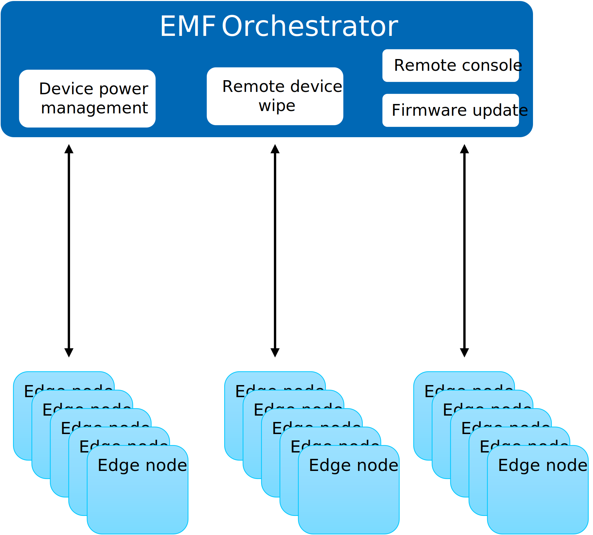
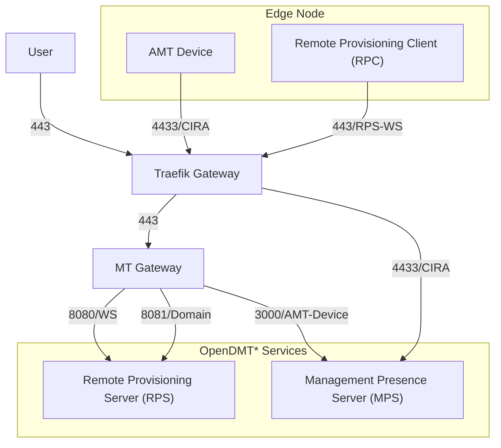
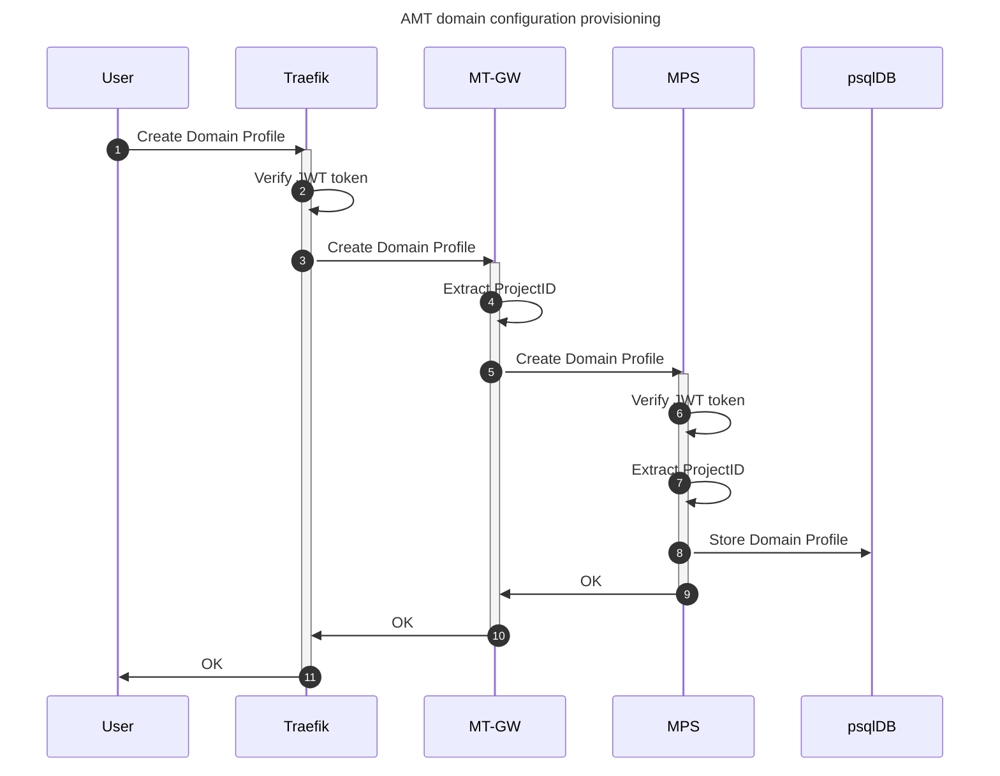

# Design Proposal: OpenDMT integration in Edge Manageability Framework

Author(s): Edge Infrastructure Manager Team

Last updated: 06/12/2025

## Abstract

[Open Device Management Toolkit](https://device-management-toolkit.github.io/docs/2.27/GetStarted/overview/) (Open DMT)
provides an open source stack through which is possible to manage
vPRO/ActiveManagementTechnology(AMT)/IntelStandardManageability(ISM) enabled devices.

This document describes the design proposal for integrating OpenDMT components in EMF in a seamless way and have them
directly available to Edge Infrastructure Managerment services or any other service running in the orchestrator

**Note:** that with reference to the above figure only device activation/deactivation and power management will be
addressed in the release 3.1.

## Proposal

The cloud-toolkit includes two core components: Management Presence Server (MPS) and Remote Provisioning Server (RPS),
see [OpenDMT documentation](https://device-management-toolkit.github.io/docs/2.27/GetStarted/overview/) for furhter details.

MPS and RPS are extended and deployed together the Edge Infrastructure Manager micro-services; they are cloud-native
and can be deployed using the OpenDMT charts.

In the following diagram, we represent the deployment of the OpenDMT services.

The Remote Provisioning Client (RPC) application runs on the managed device/Edge Node and communicates with the RPS
microservice deployed remotely. The RPC and RPS configure and [activate](./vpro-device.md) Intel AMT on the
managed device. Once properly configured, the remote managed device can call home to the MPS by establishing a Client
Initiated Remote Access (CIRA) connection with the MPS.

CIRA enables a CIRA-capable edge device to initiate and establish a persistent connection to the MPS. As long as the
managed device is connected to the network and to a power source, it can maintain a persistent connection.

**Note1:** CIRA connection is terminated directly in the MPS service;

**Note2:** Traffic on port 8080 is the web-socket established between RPC-RPS and is used to perform the configuration

**Note3:** Port 8081 is "exposed" by MT-GW to allow the configuration of the Domain and the Provisioning Certificate

**Note4:** Port 3000 is "exposed" by MT-GW to allow the retrieval of the AMT device information and potentially expose
to OBaaS audit logs and events

In DMT stack, Mosquitto can be deployed as MQTT broker to avoid the constant polling of MPS/RPS services. This will be
considered as future work to improve the scalability of the layered architecture.

Other tools such as Kong and Kuma, respectively used as traffic gateway and service mesh will be replaced by Traefik
and Istio which are currently the tools in use by the EMF platform.

OpenDMT should be configured to leverage platform services such as the centralized Database and EMF secrets service.
However they cannot be used out-of-the-box and seamless integrated in EMF: the OpenDMT services need to be aware of EMF
internals to store credentials in Vault (token expiring after 1h), handle properly Multitenancy and validate the tenant
ids.

Additionally, tokens need to be properly handled and specific roles should be created in Keycloak. As regards the
database, MPS/RPS can share the same DB of the other EMF micro-services. It is required though to create a new
instance for OpenDMT services where the RPS/MPS tables will live logically separated from the other tables.

**Note:** tenantID in OpenDMT uses UUID format and it can be provided as input to the RPC client when it is started.
However MPS/RPS services need to be
[extended](https://device-management-toolkit.github.io/docs/2.27/Reference/middlewareExtensibility/) in order to
properly handle multi-tenancy same as Keycloak tokens.

### Configuring OpenDMT stack

AMT/vPRO works using two exclusive modes: Client Control Mode and Admin Control Mode. The first provides full access to
features of Intel® AMT, but it does require user consent for all redirection features. The latter provides full access
as well but the User consent is optional for supported redirection features and comes with the "penalty" of requiring
an additional (Domain and Provisioning certificate) configuration.

**Note:** CCM is not suitable for our deployment scenarios given that providing user consent implies having monitor on
sites which might not be possible. For this reason, ACM will be the mode in use.

In terms of input, DMT requires the creation of the following configurations:

**Client Initiated Remote Access (CIRA)** config that enables a CIRA-capable edge device to initiate and establish a
persistent connection to the MPS. As long as the managed device is connected to the network and to a power source, it
can maintain a persistent connection. This
[configuration](https://device-management-toolkit.github.io/docs/2.27/GetStarted/Cloud/createCIRAConfig/) can be
automated using the set of information already available in the EMF env variables, config map and etc. See
[DM Resource Manager](./vpro-rm) for major details.

**ACM profile** config that enables the ACM mode in the device, it has a dependency with the **CIRA Configuration**.
This [configuration](https://device-management-toolkit.github.io/docs/2.27/GetStarted/Cloud/createProfileACM/) can be
automated using the set of information already available in the EMF env variables, config map and etc. See
[DM Resource Manager](./vpro-rm) for major details.

**Domain profile** is required by the ACM profile activation. This [configuration][domain-profile] cannot be automated
and requires the user to purchase and provide the provisioning certificate using PFX format and the password used to
encrypt the file. Additionally the **DNS suffix** must be either set manually through MEBX or using the DHCP Option 15;
it should be set to match the FQDN of the provisioning certificate .

For this configuration we expect the user to interact directly with RPS. This would mean that extensions to MT-GW will
be required too and RPS should be extended in order to handle MT.

The configuration is per-tenant and we expect each tenant to have its own provisioning certificate. The user is capable
to change the `Domain` configuration by removing the existing and uploading a new one. There will be multiple domain
configurations depending on how the edge infrastructure is deployed (ideally in each site there will be multiple network
segments).

**Note:** it is important to control e2e the environment and it is not possible to transfer devices from a domain to another
without disruptions.

**WLAN configuration** is not supported by GNU/Linux derived OSes. See [documentation][wireless-config] for more details.

**LAN configuration** is not considered in the existing requirements. This configuration needs to be pushed through RPS
and cannot be automated in anyhow by Edge Infrastructure Manager. See [documentation][lan-config] for more details.

### MVP Requirements

At the time of writing, the expectation is to full-fill the following requirements:

- Seamless integration of the OpenDMT stack
- Multi-tenancy and IDM token handling (using right roles and groups)
- vPRO domains configuration
- report vPRO devices data
- issue power commands
- Activation/Deactivation of the devices

## Rationale

Using directly the OpenDMT services has the undeniable advantage of providing a baseline to start with, otherwise we have
to start from scratch. However, OpenDMT does not cover all the featues exposed by vPRO skus and in future we might be
required to extend their capabilities in order to support advanced features as reprovision the device using HTTPs boot
option or secure remote erase.

One shortcoming of the MPS/RPS services is that they are written using Node.js. An alternative design would consider to
rewrite the functionalitiy of MPS/RPS using `go` which would give us a different programming model and more libraries
to use.

For example the handling of the migrations and the creation of the db which at the time of writing
are done using a [manual process](https://device-management-toolkit.github.io/docs/2.27/Deployment/upgradeVersion/),
it could be automated and realized using versioned migrations.

Another design choice considers to not expose MPS/RPS services through the MT-GW and bridge the requests through
Edge Infrastructure Manager. How to achieve this and if we should purse is left as an open question.

## Affected components and Teams

We report hereafter the affected components and teams:

- Several platform services will be affected and the active support from the Foundational Platform Services team is
required to execute the integration with FPSs.
  - IAM/MT-GW, Keycloak, Database, Traefik, Istio, Vault are the main services affected
- UI should support
  - the creation and the removal of the Domain configurations by extending the Admin page.
  - activation of vPRO during the device registration
  - power management commands
- Automation and infrastructure teams should pay careful attention when setting up the environments to test the
technology

## Implementation plan

Hereafter we present as steps the proposed plan in the release 3.1.

- DMT stack is integrated and deployed as part of the `infra-external` charts
- Split user-db creation and integrate db-creation as part of the charts
- Move user creation to the installer script
- Introduce new roles and possibly groups to have fine-grain tokens
- Substitute Kong and Kuma respectively with Traefik and Istio
- Vault root creation and refresh logic move to a job, side care container or in the DM RM
- Integrate MT-GW with RPS/MPS and expose their services
- Extend MPS to properly handle JWT tokens and ActiveProjectID
  - Requests from the north will have ActiveProjectID and the JWT token
  - Requests from the south will have only the JWT token
- Extend RPS to properly handle JWT tokens and ActiveProjectID
  - Requests from the north will have ActiveProjectID and the JWT token
  - Requests from the south will have only the JWT token
- UI to integrate with the necessary APIs exposed by RPS and MPS

## Test plan

**Unit tests** will be extended accordingly in the affected components and possibly in the DTM components the
extensions and the unit tests will be upstreamed.

**VIP tests** should verify the deployment and FPS/IAM integration. Additionally, tests should be written to verify
Domain
creation and issuing power management commands.

New **HIP tests** involving hardware devices will be written to verify the complete e2e flow.

All the aforementioned tests should include negative and failure scenarios such as failed activations, unsupported
operations.

## Open issues (if applicable)

Integration with Mosquitto is left for future iterations.

MPSRouter is additionally deployed to address MPS scalability. Should FPS consider MPSRouter integration and its
dependency with Istio?

OpenDMT stack offers device audit log and events. Should OBaaS consider how to integrate these features in the stack?

[domain-profile]: https://device-management-toolkit.github.io/docs/2.27/GetStarted/Cloud/createProfileACM/#create-a-domain-profile/
[wireless-config]: https://device-management-toolkit.github.io/docs/2.27/Reference/EA/RPSConfiguration/remoteIEEE8021xConfig/
[lan-config]: https://device-management-toolkit.github.io/docs/2.27/Reference/EA/RPSConfiguration/remoteIEEE8021xConfig/
