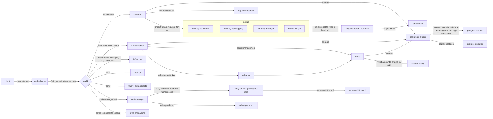

# Design Proposal: Simplification of vPro Profile

Author(s): Scott Baker

Last updated: 2026-03-16

## Abstract

This proposal describes a set of steps that may be taken to reduce the platform dependencies of the vPro profile.

## Problem Statement

This ADR explores what a “minimal” vPro Profile installation might look like, with as many
platform dependencies removed as possible. The current dependencies in the vPro profile look like
this (zoom in to read):



Platform components include:

- Ingress pipeline
  - MetalLB, allows the application to be exposed using a load-balancer
  - Traefik, used as an API gateway and an API remapper (for multitenant-compliant API).
    Also serves as an early check for JWT validity.
  - Traefik-extra-objects, holds certificates for configuring Traefik.
  - cert-manager, used to manage certificates for Traefik

- Multitenancy
  - Keycloak, used to generate JWT tokens that may be validated by Traefik and by the
    backend components. Used to manage user accounts.
  - Nexus, used as a data model for multitenancy.
  - Tenancy-init, used to initialize a single tenant environment

- Database
  - Postgres, as a database
  - Postgres-operator, used to lifecycle manage the postgres deployment
  - Postgres-secrets, used to initialize database details and populate secrets

- Secret Storage
  - Vault, used to store sensitive secrets
  - Reloader, used to periodically restart DMT when vault tokens change
  - Secrets-config, used to setup vault accounts

- Web UI, allows device management using a GUI interface

**Note:** The list of components above is not necessarily complete. In particular, there may
be additional components classified as infra-internal.

## Proposal

This proposal is divided into several sub-proposals, which may be executed independently.

### Remove MetalLB from post-installer

Effort: Low/Medium

Most modern helm charts allow the type of service to be specified – LoadBalancer, NodePort,
ClusterIP, etc. We should expose the same capability, and allow the customer to bring their own
LoadBalancer, which may or may not be MetalLB. Similarly, if the customer wants to use a
NodePort, that should not be prohibited.

We assume that Argo CD does not need to be exposed on the management interface on port 443,
we could still expose it on port 80.

We assume that ingress nginx path is not used by the vPro profile. This includes all
of the tinkerbell components (infra-onboarding). As such, the ingress and load-balancer
requirement for these boot-related components is not a dependency of the vPro profile.

Validation and development environments may still need a load-balancer, and as such we should
provide some assistance for these environments. There are two options:

- **move MetalLB to the pre-installer.** The pre-installer contains dependencies that are
  not part of the EMF software, but are usually required for it to run.

- **provide a separate script that installs MetalLB.** The advantage over adding it to the
  pre-installer is that a separate script keeps the pre-installer clean. The disadvantage is
  that it adds an additional script, which leads to more complexity during installation.

Complications

- Load-Balancer is used to allow services to expose arbitrary port numbers. Without a
  Load-Balancer, the fallback is to use NodePorts, which exist in the range
  30000-32767. Allocating ports outside this range requires special Kubernetes flags
  to be used when installing Kubernetes. Several services require ports outside
  this range. For this reason, having a load-balancer is a functional requirement for
  any deployment outside of development environments.


Recommendation is to move it to the pre-installer.

### Remove Traefik

Effort: High

Recent changes made it possible to bypass the remapping that was done by tenancy-api-mapper. The
EIM components now directly expose an API that is identical to the external API that was exposed
by the mapper. This may be used to simplify the choice of ingress / API gateway.

However, Traefik is not simply serving as an API mapper. It also aggregates multiple backend
components’ APIs together. If we want to expose only a single service, then Traefik could be
eliminated, but EIM is a combination of multiple services, and this complicates removal of
Traefik.

Removal of Traefik does not necessarily allow us to remove the requirement to have an Ingress,
because of the need to aggregate multiple APIs under a single endpoint. We could leave the
Ingress requirement in place in our charts, and leave it as a customer responsibility to provide
the Ingress itself. The customer could choose Traefik or a different tool. This would also lead
to the customer being responsible for the certificate management that was needed as part of the
Traefik service.

Complications

- Traefik may be the sole point of JWT validation for some services. In particular, it appears
  that the infra_external services may not have been updated with recent multitenancy
  refactoring that the other services went through.

- Some services such as infra-external have not yet been refactored to eliminate multitenancy
  (i.e. tenancy-api-mapping) requirements. EIM was, but infra-external was not. Until that is
  done, it is impractical to remove Traefik, given the importance of infra-external to the
  vPro profile.

- Traefik is being used for SNI termination in addition to API aggregation. Without using
  Traefik, the customer would have to replicate our rules for SNI termination.

- There are several middlewares in Traefik. Some of these middlewares are productization concerns
  that we could assign to the customer, but some may be necessary for functionality and/or
  may cover gaps in backend service security (i.e. it's unknown if all backend services implement
  their own JWT validation).

  - orch-gateway-rate-limit - rate limits incoming https traffic
  - orch-gateway-cors - allows cross-origin requests from some domains
  - orch-gateway-tcp-rate-limit - rate limits traffic on AMT
  - validate-jwt - validates JWT bearer tokens against Keycloak's JWKS endpoint
  - secure-headers - adds/removes HTTP headers
  - limit-request-size - limits HTTP request body size
  - replace-domain - rewrites internal domain references to external. (Development-only?)
  - rewrite-webui-csp-resp-header - rewrites Content-Security-Policy (Development-only?)


### Remove Reloader Job

Effort: Medium

This task requires research to see if there is an alternate way to refresh Vault tokens in DMT
components. May require DMT changes. Requires investigation and possible consultation with DMT
team.

### Remove Keycloak, Nexus, and Keycloak-Tenant-Controller

Effort: Very High

This requires more understanding regarding recent multitenancy refactoring in EIM, and to
determine whether there is sufficient support for a default-tenant in the API that does not
require a lookup of Nexus

- What JWT would be used without Keycloak? How would it be validated?

- Are there tenant controllers in infra-internal that need to be run to set up objects? How would
  they run with no tenancy data model to trigger them?

### Remove Postgres-Operator and Postgres-Secrets

We do not need an operator to manage Postgres. We could instantiate the Postgres service directly.
Secrets (username, password, etc) could be configured by simple text file, as is the case with
DMT.

### Simplify Configuration (Vault and Postgres)

Both Vault and Postgres are using Kubernetes jobs for configuration. Looking at another
implementation, DMT, configuration is specified in a simple text file that is ingested during
deployment:

```text
# POSTGRES
POSTGRES_USER=postgresadmin
POSTGRES_PASSWORD=

# VAULT
SECRETS_PATH=secret/data/
VAULT_ADDRESS=http://vault:8200
VAULT_TOKEN=
```

We should be able to do the same.

## Recommendations

Remove MetalLB from post-installer -> **proceed**

Remove Traefik -> perform **PoC** on removing Traefik as a hard requirement, allowing user to
choose ingress technology themselves.

Remove Reloader -> **proceed**

Remove Keycloak -> **defer**

Remove Postgres Operator and Postgres-Secrets -> **proceed**

Simplify Configuration -> **proceed**

## Implementation Plan

TBD

## Decision

TBD

## Open Issues (if applicable)

TBD
