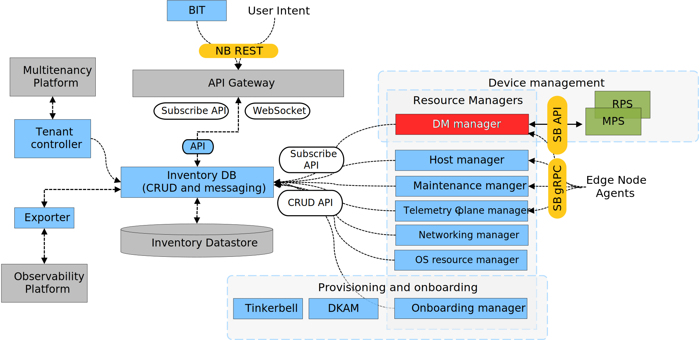
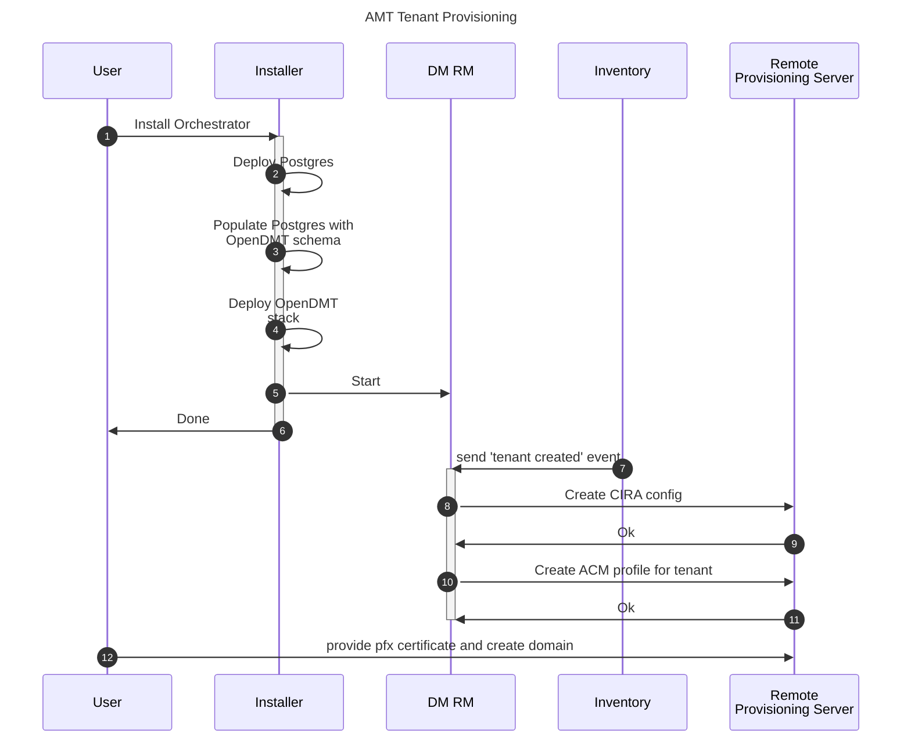
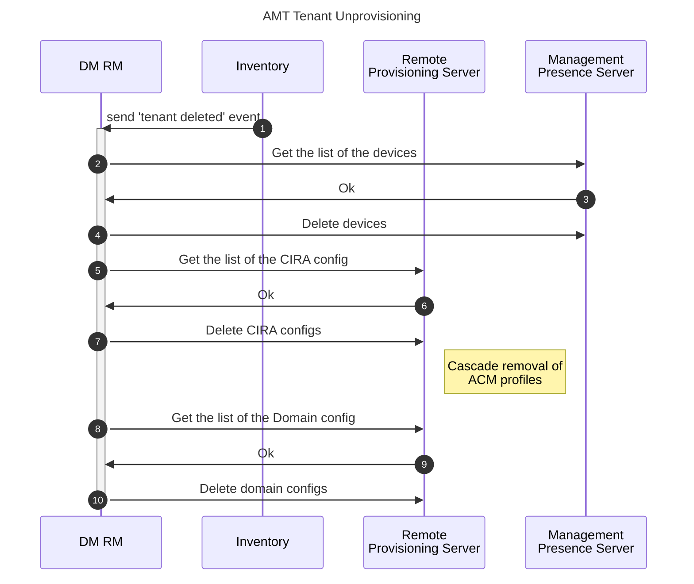
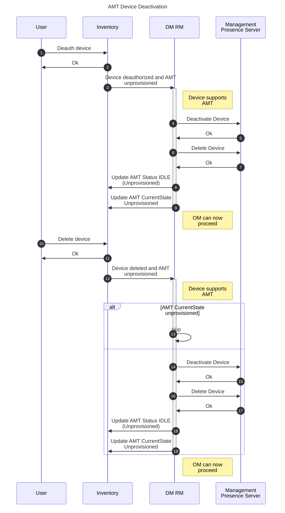
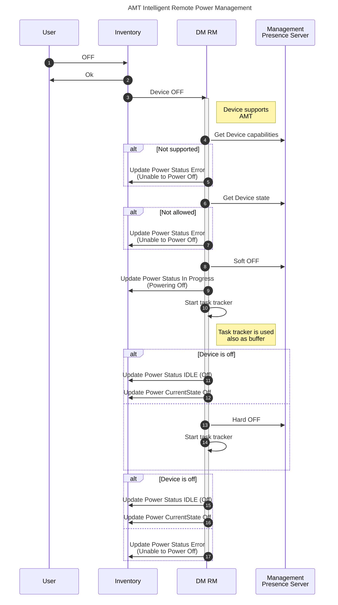

# Design Proposal: Device Management Resource Manager and Intelligent Remote Power Management

Author(s): Edge Infrastructure Manager Team

Last updated: 05/25/2025

## Abstract

Edge Infrastructure Manager introduces a Device Management Resource Manager (DM RM) to intelligent handle power
management on the Edge Node.

This design proposal elaborate on the internals of the DM RM and explain the supported capabalities for the release
3.1.

## Proposal

DM RM is a shim layer between EIM core services and Open DMT subsystem. This new manager will call the APIs exposed
by MPS and RPS to support various out-of-band and in-band workflows.

The DM RM has internal intelligence and is able to perform the right action by considering the device `capabilities`,
User intents and [PowerCommandPolicy](./vpro-eim.md); in some cases, user requirements might not be fullfilled and
the request will be rejected and the status of the operation set in error to inform the user about the unfeasibility.

**Note** that AMT capabilities are exposed by the devices through MPS APIs.

The RM exposes a SouthBound API through which the Platform Manageability Agent can connect; using device introspection
during the device discovery or after the provisioning, the RM will be able to understand in advance if the device
supports vPRO and which SKUs among the ones available on the market.

In terms of functionality, it is expected that the RM will be capabable to manage AMT activation/deactivation,
reconciliation and AMT device attestation (which implies device creation in MPS).

Additionally, it will handle device Power Management features which translates in the ability of the user to:

- Power off/on a device;
- Sleep/Hibernate a device;
- Power-cycle a device;

When `PowerCommandPolicy=ORDERED` is enabled, the DM RM will intelligently implement Off and Power-cycle routines
by trying first the soft-commands. Then, based on timers and by looking at the state of the devices will force the
hard commands (see later the sequence diagram for more details).

We do not expect the Manager to consume any `Provider` as the interaction with the OpenDMT micro-services is considered
internal.

The DM RM will be able to automate some of the configurations required by [ACM profile](./dmt-integration.dm). The RM
is driven by state in Inventory and reconcile with MPS/RPS state or when necessary by directly talking to the agent.

As regards MT handling, we will not consider the Tenant watcher approach: on create, a tenant is considered configured
when all the OpenDMT configurations are provided but the Provisioning Certificate requires user intervention.

On Tenant delete, it might be useful leverage the Watcher API and they will be considered for future iterations.
However, there is no hard dependency on the content stored in Inventory and the DM RM should terminate all the tenants
related configurations and the managed devices in the OpenDMT stack.

The device activation is considered in the [vPRO/AMT/ISM devices activation](./vpro-device.md) design proposal. Let's
now look at the device deactivation. This process will be handled as part of the device deauth and removal. The device
should not be removed if AMT deactivation is not completed yet - this introduces a virtual barrier for the Onboarding
Manager that should wait for the AMT cleanup.

Let's now consider the Intelligent Remote Power Management scenario. Edge Infrastructure Manager API will not result
to be a mirror of the OpenDMT APIs and the logic of the DM RM will be driven by several inputs:

- Device capabilities
- [Allowed transitions][allowed-transitions]
- User issued command
- [Power command policy](./vpro-eim.md)

This is done to prevent user's error and reduce the chance to leave the edge devices in an inconsitent state. In the
following diagram we consider a `PowerCommandPolicy=ORDERED`.

**Note** that in case of `PowerCommandPolicy=IMMEDIATE`, the DM RM will try immediately the hard power off command.

Similarly, the `Reset` can be handled "gently" by issuing first a soft `Reset` and then a `PowerCycleReset`. `Sleep`
and `Hibernate` will not adhere to the `PowerCommandPolicy` logic.

## MVP Requirements

The DM RM is introduced to support the following user flows:

- Configure the activation of Edge Node for vPro;
- Keep updated the activation status of the vPRO enabled devices;
- Keep updated the power status of the vPRO enabled devices;
- Intelligent Remote Power Management of the edge devices;
- Manage the deactivation of vPRO technology in the edge devices;

## Rationale

The following alternative designs for Tenancy management has been discussed and it will be evaluated in future
iterations.

- DM RM as a Tenant controller
- DM RM as a Watcher of the EIM Tenant table

Even if they provides some guarantee while handling tenancy changes there is not strong need to have them implemented
at the time of writing as, when changes are done to the Tenancy data-model or to the Inventory data-model, the DM RM
does not need to rely on this state to perform clean up of the MPS/RPS tables.

As regards the power management, simpler designs have been evaluated where Infrastructure Manager APIs mimic OpenDMT
APIs. However, they have been discarded in favor of the `PowerCommandPolicy`. In this way, the User cannot accidentally
hard power off the device and maybe leave the devices in inconsistent state or even worse corrupt some data.

## Affected components and Teams

We report hereafter the affected components and Teams:

- Device Management Resource Manager (Edge Infrastructure Manager team)

## Implementation plan

Edge Infrastructure Manager team will implement the following functionality to support this design proposal:

- Multi-tenancy handling and bootstrap configuration
- Device activation
- Status reporting
- Intelligement Remote Power Management
- Device de-activation

### Implementation plan for Admin Control Mode

For the 2025.2 release, the DM Manager implementation will be updated to activate devices using Admin Control Mode (ACM) or Client Control Mode (CCM). The proposed plan for the release is:

- Extend inventory to store the DNS Suffix and activation mode (ACM or CCM) alongside the instance ID.
  - DNS Suffix added from UI or CLI during set up.
- Extend DM Manager device activation to check for activation mode from inventory.
- Add domain profile creation when activation mode is set to admin.
- DM Manager retrieves DNS Suffix from inventory.
- DM Manager retrieves provisioning certificate and password from Vault for domain profile creation.
- Update AMT profile configuration to align with the requested activation mode selected.

Additional updates to support admin mode are documented in the [OpenDMT documentation](./vpro-opendmt.md).

### Test Plan

DM RM **Unit tests** will be extended to cover 80% of the functionality at least - these tests will include mocks for
RPS and MPS.

**API integration tests** and **VIP tests** will be improved with additional tests to verify some of the functionality
of the manager

New **HIP tests** involving hardware devices will be written to verify the complete e2e flow and verify the
functionality of the DM RM.

## Open issues (if applicable)

In API integration tests and VIP tests, advanced scenarios that involve acting on the devices could not be tested
unless we manage to run the mocks as replacement of the actual MPS/RPS - this is left as open issue.

Other functionalities such as viewing/changing boot order of the device will not be considered in the first
integration as they are not supported by OpenDMT out of the box and their need is not yet clarified.

Besideds the deactivation - the OpenDMT supports also the graceful disconnect of the managed devices; its need is not
clarified and is left open for future works.

[allowed-transitions]: https://software.intel.com/sites/manageability/AMT_Implementation_and_Reference_Guide/WordDocuments/intelamtpowerstatetransitions.htm
