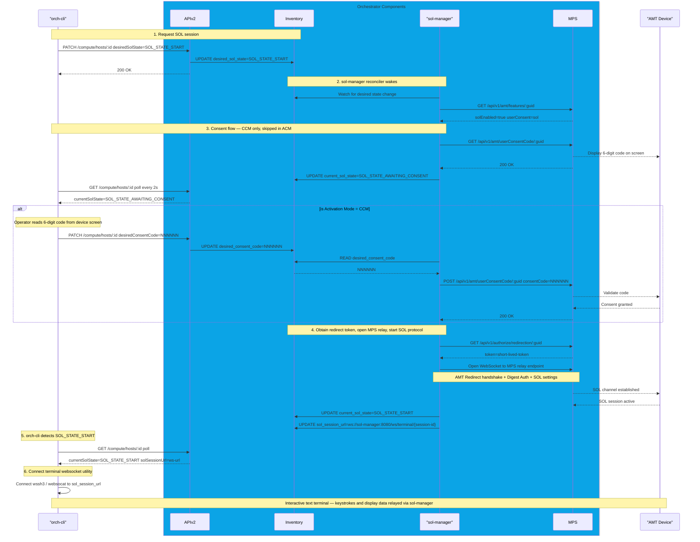

# Design Proposal: SOL and Remote KVM Operations via orch-cli

Author(s): Edge Infrastructure Manager Team

Last updated: 03/27/2026

## Abstract

This document describes the design proposal to support Serial‑over‑LAN (SOL)
and Keyboard‑Video‑Mouse (KVM) through Intel® Active Management Technology (AMT),
provided the target system is vPro‑enabled and provisioned.
The implementation leverages existing MPS infrastructure and maintains full multi-tenancy support.

### SOL (Serial Over LAN) Support

SOL provides a managed text-based console redirection. It is primarily used for
troubleshooting at the BIOS level or when the operating system is in a command-line state.

Function: It redirects the serial character stream from the remote device to your management console over the network.

Best For: Accessing BIOS/UEFI settings, interacting with Linux terminal consoles, or viewing BSOD/boot-loader text.

### KVM (Keyboard, Video, Mouse) Support

KVM is the "Remote Desktop" equivalent for out-of-band management.
Unlike software-based tools (like TeamViewer), Intel AMT KVM works at the hardware level.

Function: It allows you to see the screen and control the input of a remote system during
the entire boot process, including BIOS and OS loading.

Requirements: KVM is only available on Intel vPro® Enterprise platforms.
It is generally not available on "Standard Manageability" or "Entry" versions of AMT.

| Feature | Serial Over LAN (SOL) | Remote KVM |
| --- | --- | --- |
| Interface | Text-based (Terminal) | Graphical (GUI) |
| Bandwidth | Very Low | Moderate to High |
| BIOS Access | Yes (Text-based mode) | Yes (Full Graphical) |
| OS Support | CLI / Bootloaders | Full Windows/Linux Desktop |
| Hardware | Most AMT-enabled devices | vPro Enterprise only |

### Supported Capabilities

🔹 Serial‑over‑LAN (SOL)
SOL allows text‑based console access (BIOS/boot/OS console) even when the OS is down.
Supports:

1. Remote text console redirection
2. BIOS and boot‑time interaction
3. SOL session start/stop via REST APIs

SOL is available in both Admin Control Mode (ACM) and Client Control Mode (CCM) (consent rules differ)

🔹 KVM (Keyboard‑Video‑Mouse)
KVM provides full graphical remote control, including BIOS screens.
Supports:

1. Hardware‑based KVM (out‑of‑band)
2. Power‑off and pre‑OS access
3. High‑resolution display support (dependent on AMT version)
4. Browser‑integrated KVM using React/Angular UI components

KVM works even if:

- The OS is crashed
- No OS is installed
- The device is powered off (can power on remotely)

## Proposal

### Hardware & OS Prerequisites

1. Intel® vPro‑enabled CPU (Core i5/i7/i9 vPro or Xeon)
2. Intel® AMT firmware enabled
3. Device reachable via network
4. Network Ports and Firewall

  | Purpose | Port |
  | --- | --- |
  | 'AMT WS‑MAN (HTTP)' | 16992 |
  | 'AMT WS‑MAN (HTTPS)' | 16993 |
  | 'KVM / SOL (non‑TLS)' | 16994 |
  | 'KVM / SOL (TLS)' | 16995 |

### Proposed Architecture


**Authentication Requirements**:

- Keycloak JWT token obtained via `orch-cli login` and stored for
  subsequent commands
- User must belong to tenant that owns the project
- User must have appropriate RBAC permissions for host management

## Implementation Design

This section describes the finalized design for KVM and SOL, based on the PoC implementation in
`edge-manageability-framework/kvm-poc`. The design primarily focuses on how the KVM and SOL functionality
integrates with the EMF stack.

---

### API Design

#### APIv2 — Host Resource KVM Endpoint

**API Endpoint**: `PATCH /compute/hosts/{resourceId}`

**Request Body** (to start KVM session):

```json
{
  "desiredKvmState": "KVM_STATE_START"
}
```

**Request Body** (to stop KVM session):

```json
{
  "desiredKvmState": "KVM_STATE_STOP"
}
```

**Response** — `GET /compute/hosts/{resourceId}` (KVM fields):

```json
{
  "kvmStatus": "KVM_STATUS_ACTIVATED",
  "desiredKvmState": "KVM_STATE_START",
  "currentKvmState": "KVM_STATE_START",
  "kvmSessionUrl": "wss://mps-wss.<domain>/relay/webrelay.ashx?token=<token>&host=<guid>",
  "kvmSessionStatus": "KVM session active",
  "kvmSessionStatusIndicator": "STATUS_INDICATION_IDLE",
  "kvmSessionStatusTimestamp": 1743200000
}
```

> `kvmSessionUrl` is populated only when `currentKvmState = KVM_STATE_START`. It is an
> internal signal used by orch-cli — not surfaced to the browser.

---

#### APIv2 — Host Resource SOL Endpoint

**API Endpoint**: `PATCH /compute/hosts/{resourceId}`

**Request Body** (to start SOL session):

```json
{
  "desiredSolState": "SOL_STATE_START"
}
```

**Request Body** (to stop SOL session):

```json
{
  "desiredSolState": "SOL_STATE_STOP"
}
```

**Response** — `GET /compute/hosts/{resourceId}` (SOL fields):

```json
{
  "solStatus": "SOL_STATUS_ACTIVATED",
  "desiredSolState": "SOL_STATE_START",
  "currentSolState": "SOL_STATE_START",
  "solSessionUrl": "wss://mps-wss.<domain>/relay/webrelay.ashx?token=<token>&host=<guid>&port=16994&tls=0&mode=sol",
  "solSessionStatus": "SOL session active",
  "solSessionStatusIndicator": "STATUS_INDICATION_IDLE",
}
```

> `solSessionUrl` is populated only when `currentSolState = SOL_STATE_START`. It points to
> the sol-manager WebSocket endpoint that orch-cli connects to for the interactive terminal.

---

#### MPS REST APIs

##### 1. Get / Set SOL and KVM Features on Device

**Endpoint:** `GET /api/v1/amt/features/{guid}`

**Purpose:** Verify KVM and SOL is enabled and read the `userConsent` policy before
initiating a session.

**Response (`GetAMTFeaturesResponse`):**

```json
{
  "userConsent": "all",
  "redirection": true,
  "KVM": true,
  "SOL": true,
  "IDER": false,
  "optInState": 0,
  "kvmAvailable": true
}
```

**Endpoint:** `POST /api/v1/amt/features/{guid}`

**Purpose:** Enable KVM and SOL redirection on the device.

**Request Body (`SetAMTFeaturesRequest`):**

```json
{
  "userConsent": "none",
  "enableKVM": true,
  "enableSOL": true,
  "enableIDER": true
}
```

**Response:**

```json
{
  "status": "Updated AMT Features"
}
```

---

##### 2. User Consent Flow (CCM mode only)

> **Note:** In ACM (Admin Control Mode), the device does not require user consent and this
> flow is skipped entirely. kvm-manager proceeds directly to redirect token acquisition.

**Step 1 — Trigger on-screen code:**

`GET /api/v1/amt/userConsentCode/{guid}`

Causes the AMT device to display a 6-digit code on its physical screen.
kvm-manager writes `current_kvm_state = KVM_STATE_AWAITING_CONSENT` to
Inventory after calling this endpoint. orch-cli detects the state change
and prompts the operator interactively.

**Step 2 — Submit operator-entered code:**

`POST /api/v1/amt/userConsentCode/{guid}`

```json
{
  "consentCode": "NNNNNN"
}
```

kvm-manager reads `desired_consent_code` from Inventory (written by
orch-cli after the operator enters the code) and submits it here.
On success, consent is granted and kvm-manager proceeds to token acquisition.

---

##### 3. Redirect Token Acquisition

**Endpoint:** `GET /api/v1/authorize/redirection/{guid}`

**Purpose:** Obtain a short-lived bearer token that authorises
a WebSocket relay session for the specified device.

**Response:**

```json
{
  "token": "<short-lived-redirect-token>"
}
```

This token is written into `kvm_session_url` in Inventory by kvm-manager:

```text
wss://mps-wss.<domain>/relay/webrelay.ashx?token=<token>&host=<guid>
```

---

##### 4. WebSocket Relay (used by orch-cli, not kvm-manager)

**Endpoint:** `WSS /relay/webrelay.ashx`

**Query parameters:**

| Parameter | Value | Description |
| --- | --- | --- |
| `token` | redirect token | Short-lived token from `/authorize/redirection` |
| `host` | device GUID | AMT device identifier |
| `port` | `16994` | KVM redirection port |
| `p` | `2` | Protocol type (2 = redirection) |

**Headers required by orch-cli:**

```text
Sec-WebSocket-Protocol: <redirect_token>
```

The relay endpoint is accessed by orch-cli (not kvm-manager) after reading
`kvm_session_url` from Inventory. orch-cli performs the AMT Redirect protocol
handshake over this connection using the AMT admin password from Vault.

---

### KVM Operational Flow

The sequence below traces a full KVM session from the operator running `orch-cli` through to
a live RFB desktop rendered in the browser.

```mermaid
sequenceDiagram
    participant Browser as Browser
    participant CLI as "orch-cli(embeds angular-client)"
box rgba(11, 164, 230, 1) Orchestrator Components
    participant APIV2 as APIv2
    participant INV as Inventory
    participant DM as "kvm-manager"
    participant MPS as MPS
end
    participant AMT as "AMT Device"
    

    Note over CLI,INV: 1. Request KVM session
    CLI->>APIV2: PATCH /compute/hosts/:id desiredKvmState=KVM_STATE_START
    APIV2->>INV: UPDATE desired_kvm_state=KVM_STATE_START
    APIV2-->>CLI: 200 OK

    Note over DM,INV: 2. kvm-manager reconciler wakes
    DM->>INV: Watch for desired state change
    DM->>MPS: GET /api/v1/amt/features/:guid
    MPS-->>DM: kvmEnabled=true userConsent=kvm

    alt is Activation Mode = CCM
    Note over DM,CLI: 3. Consent flow - CCM only, skipped in ACM
    DM->>MPS: GET /api/v1/amt/userConsentCode/:guid
    MPS-->>AMT: Display 6-digit code on screen
    MPS-->>DM: 200 OK
    DM->>INV: UPDATE current_kvm_state=KVM_STATE_AWAITING_CONSENT

    CLI->>APIV2: GET /compute/hosts/:id poll every 2s
    APIV2-->>CLI: currentKvmState=KVM_STATE_AWAITING_CONSENT

    Note over CLI: Operator reads 6-digit code from device screen
    CLI->>APIV2: PATCH /compute/hosts/:id desiredConsentCode=NNNNNN
    APIV2->>INV: UPDATE desired_consent_code=NNNNNN

    DM->>INV: READ desired_consent_code
    INV-->>DM: NNNNNN
    DM->>MPS: POST /api/v1/amt/userConsentCode/:guid consentCode=NNNNNN
    MPS-->>AMT: Validate code
    AMT-->>MPS: Consent granted
    MPS-->>DM: 200 OK
    end
    Note over DM,INV: 4. Obtain redirect token and write session URL
    DM->>MPS: GET /api/v1/authorize/redirection/:guid
    MPS-->>DM: token=short-lived-token
    DM->>INV: UPDATE current_kvm_state=KVM_STATE_START
    DM->>INV: UPDATE kvm_session_url with relay URL

    Note over CLI: 5. orch-cli detects KVM_STATE_START and starts local proxy
    CLI->>APIV2: GET /compute/hosts/:id poll
    APIV2-->>CLI: currentKvmState=KVM_STATE_START kvmSessionUrl=relay-url
    CLI->>CLI: Start local HTTP server on random port
    CLI->>Browser: Open browser at localhost

    Note over Browser,CLI: 6. Browser connects and launches KVM session
    Browser->>CLI: POST /api/connect
    CLI->>MPS: Open WebSocket to MPS relay endpoint
    Note over CLI,MPS: AMT Redirect handshake, password stays in orch-cli
    MPS-->>AMT: Relay channel open
    AMT-->>MPS: RFB begins
    CLI-->>Browser: 200 OK
    Browser->>CLI: Connect WebSocket /ws/kvm

    Note over Browser,AMT: 7. Live KVM session
    AMT-->>MPS: FramebufferUpdate
    MPS-->>CLI: binary frames
    CLI-->>Browser: binary frames
    Browser->>Browser: Decode tiles and render on canvas
    Browser->>CLI: PointerEvent / KeyEvent
    CLI->>MPS: Forward input
    MPS-->>AMT: Input delivered

    Note over Browser,AMT: 8. KVM session teardown
    Note over Browser,CLI: Two equivalent stop triggers — both converge on the same downstream flow
    alt Browser-initiated stop (tab closes or clicks Stop button in UI)
    Browser-xCLI: WebSocket /ws/kvm disconnected (tab close or POST /api/disconnect)
    CLI->>CLI: browser gone / disconnect request
    else orch-cli initiated stop (orch-cli --kvm stop)
    CLI->>CLI: operator runs --kvm stop; signals local HTTP server to close
    end
    CLI-xMPS: Close wss://mps-wss.domain.com/relay/... (WebSocket close frame)
    MPS-xAMT: MPS relay terminates — AMT KVM channel closes
    CLI->>APIV2: PATCH /compute/hosts/:id desiredKvmState=KVM_STATE_STOP
    APIV2->>INV: UPDATE desired_kvm_state=KVM_STATE_STOP
    APIV2-->>CLI: 200 OK
    Note over DM,INV: kvm-manager reconciler wakes on desired=STOP
    DM->>INV: UPDATE current_kvm_state=KVM_STATE_STOP
    DM->>INV: CLEAR kvm_session_url=""
    DM->>INV: UPDATE kvm_session_status="KVM session stopped"
    DM->>INV: UPDATE kvm_session_status_indicator=STATUS_INDICATION_IDLE
```

---

### SOL Operational Flow



---

### Proto Schema Changes

#### New Enums and Fields for KVM

```protobuf
enum KvmStatus {
  KVM_STATUS_UNSPECIFIED = 0;
  KVM_STATUS_ACTIVATED   = 1; // KVM feature is currently enabled on the AMT device.
  KVM_STATUS_DEACTIVATED = 2; // KVM feature is currently disabled on the AMT device.
}

// KVM session state — the desired and current lifecycle state of a KVM remote session.
// Used for both desired_kvm_state (user-writable) and current_kvm_state (kvm-manager-set).
enum KvmState {
  KVM_STATE_UNSPECIFIED      = 0;
  KVM_STATE_START            = 1; // Desired: operator requests session start.
                                  // Current: session is active, kvm_session_url is valid.
  KVM_STATE_STOP             = 2; // Desired: operator requests session teardown.
                                  // Current: session has terminated cleanly.
  KVM_STATE_AWAITING_CONSENT = 3; // Current only: kvm-manager triggered consent on device;
                                  // waiting for operator to enter the on-screen 6-digit code.
  KVM_STATE_ERROR            = 4; // Current only: kvm-manager encountered an error
                                  // (AMT not provisioned, MPS failure, or token TTL expired).
}
```

#### `infra-core/inventory/api/compute/v1/compute.proto` — new KVM fields on `HostResource`

```protobuf

  // KVM feature activation status on the AMT device.
  // Set by kvm-manager RM after reading GET /api/v1/amt/features/{guid}.
  // Updated whenever kvm-manager reconciles a KVM_STATE_START request.
  KvmStatus kvm_status = 88 [(ent.field) = {optional: true}];

  // Desired KVM session state. Written by operator via APIv2 (orch-cli --kvm start|stop).
  // Valid write values: KVM_STATE_START, KVM_STATE_STOP.
  // Consumed by kvm-manager RM to drive the session lifecycle.
  KvmState desired_kvm_state = 101 [(ent.field) = {optional: true}];

  // Current KVM session state. Set by kvm-manager RM only.
  // Lifecycle: UNSPECIFIED → START → [AWAITING_CONSENT → START] | STOP | ERROR.
  KvmState current_kvm_state = 102 [(ent.field) = {optional: true}];

  // WebSocket relay URL for the active KVM session.
  // Format: wss://mps-wss.<domain>/relay/webrelay.ashx?token=<token>&host=<guid>
  // Populated by kvm-manager when current_kvm_state transitions to KVM_STATE_START.
  // Cleared to "" on session end. Internal signal only — never surfaced to the browser.
  string kvm_session_url = 103 [
    (ent.field) = {optional: true},
    (buf.validate.field).string = {max_bytes: 2048},
    (buf.validate.field).ignore = IGNORE_IF_UNPOPULATED
  ];

  // Human-readable status message describing the current KVM session state.
  // Set by kvm-manager RM only. Updated atomically with kvm_session_status_indicator
  // and kvm_session_status_timestamp.
  string kvm_session_status = 104 [
    (ent.field) = {optional: true},
    (buf.validate.field).string = {max_bytes: 1024},
    (buf.validate.field).ignore = IGNORE_IF_UNPOPULATED
  ];

  // Indicates the severity/dynamicity of kvm_session_status (e.g. IDLE, IN_PROGRESS, ERROR).
  // Set by kvm-manager RM only.
  status.v1.StatusIndication kvm_session_status_indicator = 105 [(ent.field) = {optional: true}];

  // UTC epoch timestamp (seconds) when kvm_session_status was last changed.
  // Set by kvm-manager RM only.
  uint64 kvm_session_status_timestamp = 106 [(ent.field) = {optional: true}];

  // Six-digit user-consent code entered by the operator from the device's physical screen.
  // Written by orch-cli via APIv2 when current_kvm_state = KVM_STATE_AWAITING_CONSENT.
  // Consumed (read then cleared) by kvm-manager to call POST /api/v1/amt/userConsentCode/{guid}.
  // Validated as exactly six decimal digits.
  string desired_consent_code = 107 [
    (ent.field) = {optional: true},
    (buf.validate.field).string = {pattern: "^[0-9]{6}$"},
    (buf.validate.field).ignore = IGNORE_IF_UNPOPULATED
  ];
```

**Field visibility on `HostResource`:**

| Field | Proto # | Field Behavior | Set by |
| --- | --- | --- | --- |
| `kvmStatus` | 88 | OUTPUT_ONLY | kvm-manager |
| `desiredKvmState` | 101 | OPTIONAL | orch-cli |
| `currentKvmState` | 102 | OUTPUT_ONLY | kvm-manager |
| `kvmSessionUrl` | 103 | OUTPUT_ONLY | kvm-manager |
| `kvmSessionStatus` | 104 | OUTPUT_ONLY | kvm-manager |
| `kvmSessionStatusIndicator` | 105 | OUTPUT_ONLY | kvm-manager |
| `kvmSessionStatusTimestamp` | 106 | OUTPUT_ONLY | kvm-manager |
| `desiredConsentCode` | 107 | OPTIONAL (write-only, not returned on GET) | orch-cli |

---

---

#### New Enums and Fields for SOL

```protobuf
enum SolStatus {
  SOL_STATUS_UNSPECIFIED = 0;
  SOL_STATUS_ACTIVATED   = 1; // SOL feature is currently enabled on the AMT device.
  SOL_STATUS_DEACTIVATED = 2; // SOL feature is currently disabled on the AMT device.
}

// SOL session state — the desired and current lifecycle state of a SOL remote session.
// Used for both desired_sol_state (user-writable) and current_sol_state (sol-manager-set).
enum SolState {
  SOL_STATE_UNSPECIFIED      = 0;
  SOL_STATE_START            = 1; // Desired: operator requests session start.
                                  // Current: session is active, sol_session_url is valid.
  SOL_STATE_STOP             = 2; // Desired: operator requests session teardown.
                                  // Current: session has terminated cleanly.
  SOL_STATE_AWAITING_CONSENT = 3; // Current only: sol-manager triggered consent on device;
                                  // waiting for operator to enter the on-screen 6-digit code.
  SOL_STATE_ERROR            = 4; // Current only: sol-manager encountered an error
                                  // (AMT not provisioned, MPS failure, or token TTL expired).
}
```

---

#### `infra-core/inventory/api/compute/v1/compute.proto` — new SOL fields on `HostResource`

```protobuf

  // SOL feature activation status on the AMT device.
  // Set by sol-manager RM after reading GET /api/v1/amt/features/{guid}.
  // Updated whenever sol-manager reconciles a SOL_STATE_START request.
  SolStatus sol_status = 108 [(ent.field) = {optional: true}];

  // Desired SOL session state. Written by operator via APIv2 (orch-cli --sol start|stop).
  // Valid write values: SOL_STATE_START, SOL_STATE_STOP.
  // Consumed by sol-manager RM to drive the session lifecycle.
  SolState desired_sol_state = 109 [(ent.field) = {optional: true}];

  // Current SOL session state. Set by sol-manager RM only.
  // Lifecycle: UNSPECIFIED → START → [AWAITING_CONSENT → START] | STOP | ERROR.
  SolState current_sol_state = 110 [(ent.field) = {optional: true}];

  // WebSocket URL for the active SOL session.
  // Format: ws://sol-manager:8080/ws/terminal/{session-id}
  // Populated by sol-manager when current_sol_state transitions to SOL_STATE_START.
  // Cleared to "" on session end. Used by orch-cli to connect the terminal WebSocket.
  string sol_session_url = 111 [
    (ent.field) = {optional: true},
    (buf.validate.field).string = {max_bytes: 2048},
    (buf.validate.field).ignore = IGNORE_IF_UNPOPULATED
  ];

  // Human-readable status message describing the current SOL session state.
  // Set by sol-manager RM only. Updated atomically with sol_session_status_indicator
  // and sol_session_status_timestamp.
  string sol_session_status = 112 [
    (ent.field) = {optional: true},
    (buf.validate.field).string = {max_bytes: 1024},
    (buf.validate.field).ignore = IGNORE_IF_UNPOPULATED
  ];

  // Indicates the severity/dynamicity of sol_session_status (e.g. IDLE, IN_PROGRESS, ERROR).
  // Set by sol-manager RM only.
  status.v1.StatusIndication sol_session_status_indicator = 113 [(ent.field) = {optional: true}];

```

**Field visibility on `HostResource` (SOL):**

| Field | Proto # | Field Behavior | Set by |
| --- | --- | --- | --- |
| `solStatus` | 108 | OUTPUT_ONLY | sol-manager |
| `desiredSolState` | 109 | OPTIONAL | orch-cli |
| `currentSolState` | 110 | OUTPUT_ONLY | sol-manager |
| `solSessionUrl` | 111 | OUTPUT_ONLY | sol-manager |
| `solSessionStatus` | 112 | OUTPUT_ONLY | sol-manager |
| `solSessionStatusIndicator` | 113 | OUTPUT_ONLY | sol-manager |

> **Note:** SOL reuses the existing `desired_consent_code` field (proto #107) for the
> user-consent flow, since KVM and SOL sessions are mutually exclusive per device.

---

### KVM State Machine

> **Prerequisites — before `KVM_STATE_START` can be accepted by kvm-manager:**
>
> - `current_amt_state = AMT_STATE_PROVISIONED` — the device must be fully activated via RPS.
> - `current_power_state = POWER_STATE_ON` — the device must be powered on.
> If either condition is not met, kvm-manager writes `current_kvm_state = KVM_STATE_ERROR`
> and no session is established.
>
> **Power operations while KVM is active:**
> While `current_kvm_state = KVM_STATE_START`, kvm-manager blocks any incoming
> `desired_power_state` change requests for the host. Power operations (reset, power-off)
> will be rejected until the KVM session reaches `KVM_STATE_STOP` or
> `KVM_STATE_ERROR`. This prevents the active console session from being interrupted by
> an unintentional power command.

| `desired_kvm_state` | `current_kvm_state` | Who writes | Meaning |
| --- | --- | --- | --- |
| — | `KVM_STATE_UNSPECIFIED` | — | No KVM session active or requested |
| `KVM_STATE_START` | unchanged | orch-cli via APIv2 | Operator requests session start (`--kvm start`) |
| `KVM_STATE_START` | `KVM_STATE_AWAITING_CONSENT` | kvm-manager | Device has consent policy; kvm-manager triggered on-screen code display |
| `KVM_STATE_START` | `KVM_STATE_START` | kvm-manager | Relay token obtained; `kvm_session_url` valid; session live |
| `KVM_STATE_STOP` | unchanged | orch-cli via APIv2 | Operator requests session teardown (`--kvm stop`) |
| `KVM_STATE_STOP` | `KVM_STATE_STOP` | kvm-manager | Session terminated cleanly; `kvm_session_url` cleared |
| unchanged | `KVM_STATE_ERROR` | kvm-manager | AMT not provisioned, MPS failure, or token TTL expired |

**Transition rules:**

| From (`current_kvm_state`) | To (`current_kvm_state`) | Trigger | Who |
| --- | --- | --- | --- |
| UNSPECIFIED / STOP / ERROR | — (desired=START set) | `orch-cli --kvm start` | orch-cli |
| — (desired=START) | AWAITING_CONSENT | Device `userConsent` policy is enabled | kvm-manager |
| AWAITING_CONSENT | START (active) | Consent code validated by MPS | kvm-manager |
| — (desired=START) | START (active) | Redirect token obtained; `kvm_session_url` written | kvm-manager |
| — (desired=START) | ERROR | AMT not provisioned / MPS API failure | kvm-manager |
| START (active) | — (desired=STOP set) | `orch-cli --kvm stop` | orch-cli |
| — (desired=STOP) | STOP | kvm-manager reconciler clears URL | kvm-manager |
| START (active) | ERROR | Token TTL expired or unexpected MPS disconnect | kvm-manager |

---

### Component Responsibilities

| Component | Responsibility |
| --- | --- |
| **infra-core/inventory** | Persist desired/current KVM state and all session fields as defined in the proto above |
| **infra-core/apiv2** | Expose `PATCH`/`GET` for KVM fields on `HostResource`; enforce `OPTIONAL`/`OUTPUT_ONLY` field-behavior visibility |
| **infra-external/kvm-manager** | New dedicated KVM Resource Manager (RM) — sole caller of all MPS REST APIs for KVM; writes relay token URL and state back to Inventory; coordinates user-consent flow |
| **infra-external/sol-manager** | New dedicated SOL Resource Manager (RM) — sole caller of all MPS REST APIs for SOL; writes relay token URL and state back to Inventory; coordinates user-consent flow |
| **orch-cli** | Reads `kvm_session_url` from Inventory; starts local HTTP proxy server; embeds and serves Angular KVM viewer; performs AMT Redirect handshake using Vault credentials; coordinates consent code prompt with operator |
| **Angular KVM viewer** | Renders RFB canvas; encodes mouse/keyboard input and relays via orch-cli WebSocket proxy |

#### kvm-manager/ sol-Manager : MPS REST Calls

kvm-manager is the **sole caller** of MPS REST APIs for KVM operations.
sol-manager is the **sole caller** of MPS REST APIs for SOL operations.

| Step | MPS Call | Purpose |
| --- | --- | --- |
| Pre-condition | `GET /api/v1/amt/features/{guid}` | Verify KVM enabled; read `userConsent` policy |
| Consent trigger | `GET /api/v1/amt/userConsentCode/{guid}` | Cause device to display 6-digit code on physical screen |
| Consent submit | `POST /api/v1/amt/userConsentCode/{guid}` | Validate operator-entered code; grant consent |
| Token acquisition | `GET /api/v1/authorize/redirection/{guid}` | Obtain short-lived redirect token (5-min TTL) |

#### Local HTTP Server Routes

When `--kvm start` is invoked, orch-cli starts a local HTTP server on a random
OS-assigned port (`net.Listen("tcp", ":0")`):

| Route | Method | Handler |
| --- | --- | --- |
| `/` | GET | Serve embedded Angular app (`//go:embed static/*`) |
| `/api/connect` | POST | Open WS to MPS; perform AMT Redirect handshake; return 200 when RFB ready |
| `/api/status` | GET | Return session state: `connecting` / `active` / `error` / `disconnected` |
| `/api/disconnect` | POST | Close MPS WebSocket gracefully |
| `/ws/kvm` | GET (WS upgrade) | Attach browser WebSocket to active MPS session — pure byte relay |

```text
kvm_session_url (in Inventory):  wss://mps-wss.<domain>/relay/webrelay.ashx?token=X&host=GUID
                                                  │
                                    orch-cli reads this internally
                                    orch-cli opens WS here (after Angular triggers /api/connect)
                                                  │
                                Browser never sees this URL
                                Browser only knows: ws://localhost:57432/ws/kvm
```

#### Angular Embedded in orch-cli

The Angular KVM viewer is embedded into the orch-cli binary at compile time:

```text
Build pipeline:
  1.  cd kvm-angular-app && ng build
        outputPath.base = "../server/static"   # angular.json
        browser = ""                           # flat output, no subdirectory
  2.  go build  (//go:embed static/* in orch-cli)
        → single binary with Angular assets embedded
        → no runtime dependency on npm, node, or file paths
```

```go
//go:embed static
var staticFiles embed.FS
```

The browser launch URL carries only the hostId query parameter — no credentials,
no relay URL:

```text
xdg-open "http://localhost:57432/?hostId=<host-resource-id>"
```

---

### orch-cli Commands

#### KVM

##### 1. Start KVM Session

```bash
orch-cli set host <host-resource-id> --project <project-name> \
  --api-endpoint "https://api.${CLUSTER}" \
  --kvm start
```

**Flow:**

1. Sends `PATCH /compute/hosts/{id}` with `desiredKvmState = KVM_STATE_START`
2. Polls `GET /compute/hosts/{id}` every 2 s (timeout 60 s)
3. If `currentKvmState = KVM_STATE_AWAITING_CONSENT` is detected, prompts the operator
   for the 6-digit code shown on the device screen; submits it via `PATCH` (`desiredConsentCode`)
   and resumes polling
4. Once `currentKvmState = KVM_STATE_START`, starts the local HTTP server on a random port
5. Calls `xdg-open` to launch the embedded Angular viewer in the default browser

**Output:**

```text
KVM session active.
Opening viewer at http://localhost:57432/
```

#### 2. Stop KVM Session

A KVM session can be stopped by **either** the browser UI or `orch-cli`.
Both paths converge on the same teardown sequence.

**Trigger A — Browser-initiated stop:**

- Operator closes the browser tab, or clicks a **Stop** button in the Angular viewer
- Angular calls `POST /api/disconnect` (or the `/ws/kvm` WebSocket closes)
- orch-cli detects the disconnect, closes the MPS relay WebSocket, then sends the
  PATCH below

**Trigger B — orch-cli command:**

```bash
orch-cli set host <host-resource-id> --project <project-name> \
  --api-endpoint "https://api.${CLUSTER}" \
  --kvm stop
```

**Common teardown flow (both triggers):**

1. orch-cli closes `wss://mps-wss.<domain>/relay/...` (WebSocket close frame)
2. MPS relay terminates → AMT KVM channel closes on the device
3. orch-cli sends `PATCH /compute/hosts/{id}` with `desiredKvmState = KVM_STATE_STOP`
4. kvm-manager reconciler wakes, clears `current_kvm_state`, `kvm_session_url`,
   and sets status to idle

**Output (orch-cli):**

```text
KVM session stopped for host: <host-resource-id>
```

**Output (browser):** Angular viewer shows disconnected state.

#### 3. Check KVM Status

```bash
orch-cli get host <host-resource-id> --project <project-name> \
  --api-endpoint "https://api.${CLUSTER}"
```

**Output (KVM section):**

```text
KVM Info:

-   KVM State:    KVM_STATE_START
-   KVM Status:   KVM session active
```

---

#### SOL

##### 1. Start SOL Session

## Architecture Open (if applicable)
