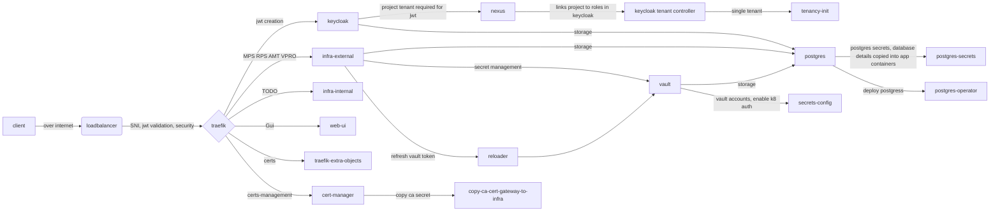

# vpro chart dependancy

```mermaid
flowchart LR

A[client] -->|over internet| loadbalancer(loadbalancer)
loadbalancer -->|SNI, jwt validation, security| traefik{traefik}
traefik -->|jwt creation| keycloak[keycloak]
traefik -->|MPS RPS AMT VPRO| infra-external[infra-external]
traefik -->|TODO| infra-internal[infra-internal]
traefik -->|Gui| web-ui[web-ui]
traefik -->|certs| traefik-extra-objects[traefik-extra-objects]
traefik -->|certs-management| cert-manager[cert-manager]
cert-manager --> |copy ca secret| copy-ca-cert-gateway-to-infra[copy-ca-cert-gateway-to-infra]
keycloak -->|project tenant required for jwt| nexus[nexus]
keycloak -->|storage| postgres[postgres]
nexus -->|links project to roles in keycloak| ktc[keycloak tenant controller]
ktc -->|single tenant| tenancy-init[tenancy-init]
infra-external -->|storage| postgres[postgres]
infra-external -->|secret management| vault[vault]
infra-external -->|refresh vault token| reloader
reloader --> vault[vault]
vault -->|storage| postgres[postgres]
vault -->|vault accounts, enable k8 auth| secrets-config[secrets-config]
postgres -->|postgres secrets, database details copied into app containers| postgres-secrets[postgres-secrets]
postgres -->|deploy postgress| postgres-operator[postgres-operator]
```
