# On-Prem Orchestrator in an Azure VM

This document details the steps required to deploy On-Prem Orchestrator in an Azure VM. It is based
on release `24.05.1-rc4`. The steps will differ slightly between different versions.

## Architecture Overview



### Design Considerations

- Why do we need to expose `NodePort` instead of `LoadBalancer`?
  - Unlike AWS CNI or Azure CNI which assumes a flat network, Calico, the CNI we use in on-prem, has a separate CIDR
    that is not addressable from outside of the K8s node
- Why do we need Load Balancers? Can't we attach public IP to VM and access via NodePort?
  - No. Some services such as Keycloak assume port 443. We need LB to do the port conversion
- What's the difference between NAT GW outbound and LB outbound
  - LB outbound is only used to reply traffic that comes into LB originally
  - NAT GW outboud is for traffic originated from inside the VM, such as `apt` and generic Internet access.
- Why don't we expose Argo CD as well? How do we access it?
  - We can, but this is not strictly required. We can expose the Service as NodePort and add one more frontend IP to the
    LB
  - We can still use `sshuttle -r orch-vm 10.43.100.0/24` to set up a tunnel and access Argo CD GUI at
    `10.43.100.1` when needed

## Prerequisite

We need to prepare our Azure account for the Orchestrator deployment.
It is possible to reuse existing cloud resources such as virtual network.
However, we assume a clean environment in the following sections for simplicity.

- Obtain an Azure subscription
- Create a resource group
  - We created `orch-onprem` in this example
- Create a virtual network
  - We created `orch` and used the address space `10.0.0.0/16` in this example
- Create a subnet under virtual network
  - We created `orch-subnet-1` and use the prefix `10.0.0.0/24` in this example
- Allocate three (3) public IP addresses
  - One for NAT gateway (`orch-nat-gw`)
  - One for Traefik/SSH load balancer (`orch-traefik`)
  - One for Tinkerbell Nginx load balancer (`orch-nginx`)
- Create network security group
  - Adjust according to your company policy
  - We created `orch-nsg` and only allow inbound traffic from Intel California proxies, Oregon proxies, and SC Lab
- Setup a NAT gateway for outbound traffic
  - Attach NAT gateway to subnet `orch-subnet-1` and associate public IP `orch-nat-gw`

## Create a VM

There are a few requirements for the VM (`orch-vm`) on which Orchestrator will run. Please check [Edge
Orchestrator On-Premises Resource
Requirements](https://edc.intel.com/content/www/us/en/secure/design/confidential/tools/edge-orchestrator-on-prem-deployment-guide/intel-tiber-edge-platform-system-requirements/#system-requirements-on-prem-orch)
for more up to date information.

- Ubuntu 22.04 LTS
  - We used the stock image from Canonical
- **16 vCores, 64G memory**
  - We used `D16sv5` instance type, but any x86 VM should work
- **128G** of root file system where OS runs
- **512G** of additional disk

## Set up VM access

- Setup Azure load balancer
  - Two (2) frontend public IPs, one for Traefik/SSH (`orch-traefik`), another for Tinkerbell Nginx
    (`orch-nginx`)
  - Backend pool has only one (1) entry: `orch-vm` NIC
  - Add Three (3) load balancer rules
    - `orch-traefik` 443 -> 30443 (Traefik)
    - `orch-nginx` 443 -> 31443 (Nginx)
    - `orch-traefik` SSH 22 -> 22 (SSH)
- Setup DNS
  - `azure.espdstage.infra-host.com` A record-> `orch-traefik`
    - Other orchestrator dns, except tinkerbell-nginx CNAME record -> `azure.espdstage.infra-host.com`
  - `tinkerbell-nginx.espdstage.infra-host.com` A record -> `orch-nginx`

## Set up environment variables

```sh
# IP for MetalLB. No need to change
export IPStart="10.43.100.1"
export IPEnd="10.43.100.10"
```

## Download the script

[access_script.sh](https://github.com/open-edge-platform/edge-manageability-framework/on-prem-installers/blob/main/terraform/scripts/access_script.tftpl)
is the only script we need to obtain. It will install all the necessary tools and download the rest of the artifacts
from release service.

Update the filename and set the correct permission:

```sh
mv access_script.tftpl access_script.sh
chmod a+x access_script.tftpl
```

We need to manually edit `S_VERSION` in line 8 from `latest-main-dev` to `v24.05.1-rc4`

```sh
sed -i 's/S_VERSION="latest-main-dev"/S_VERSION="v24.05.1-rc4"/' access_script.sh
```

⚠️ TODO: this should be resolved when it is released.

## Install Orchestrator

Install tools and download artifact

```sh
./access_script.sh
```

Run the installer script

```sh
./onprem-installer.sh
```

This script is interactive and will require a few parameters input along the way.

- Refresh token
  - Just copy paste the release service refresh token we noted down earlier
- Start / End IP
  - This is the IP range for MetalLB. The default should work just fine
  - Start IP: `10.43.100.1`
  - End IP: `10.43.100.10`
- Proceed
  - Just answer `Y` to proceed

⚠️ TODO: honor the environment variable if it's set so it no longer requires manual input

Confirm the completion

```sh
kubectl get applications -A # Should show that all Argo CD apps are Synced and Ready
kubectl get pods -A         # Should show that all pods are either Ready or Completed
```

## Access the orchestrator

⚠️ TODO: Automation in progress. It is currently high touch, including manually pushing config to gitea

### Update orch-configs via Gitea

- `kubectl -n gitea port-forward svc/gitea-http 3000`
- Switch `traefikSvcType` in `profiles/profile-onprem.yaml` from `LoadBalancer` to `NodePort`
  - Traefik and Nginx will be switch to NodePort 30443 and 31443 respectively
- Update `clusterDomain` in `clusters/onprem.yaml` from `cluster.onprem` to `azure.espdstage.infra-host.com`. A few
  things need to be restarted to make this effective
  - Delete dkam-pvc, dkam pod and tinkerbell pod to make sure the new cert is loaded and the pxe image is signed
    - This seems only done at 1st deploymet. Can be improved.
    - Check cert under tinkerbell pod `/usr/share/nginx/html/keys` with `openssl x509 -noout -text` to make sure it has
      the correct domain name
  - ⛔️ TODO: Rancher still use `keycloak.cluster.onprem` as OIDC endpoint, and therefore LDAP login doens't work.
    Require investigation into `ecm`

### Setup Certificate

- Sign cert using certbot (LetsEncrypt)
  - Replace the `tls-orch` K8s Secret in `orch-gateway` namespace with new cert

## Setup Orchestrator

Follow [this
guide](https://edc.intel.com/content/www/us/en/secure/design/confidential/tools/edge-orchestrator-on-prem-deployment-guide/create-an-os-profile-for-on-premises-deployments/#gs-os-profile-on-prem)
to create OS profile

## Onboard an Edge Node

Follow [this
guide](https://edc.intel.com/content/www/us/en/secure/design/confidential/tools/edge-orchestrator/onboard-edge-node-for-dell-poweredge-xr12-rack-server/)
to onboard an Edge Node. This doc only includes instruction for Windows and Linux client. For MacOS, follow [this
guide](https://gist.github.com/k0ste/63d8c3da42c7d627a50bc9a21803ba36) to run `racadm` tool from Docker container.

⚠️ TODO: Host `racadm` container image ourselves
