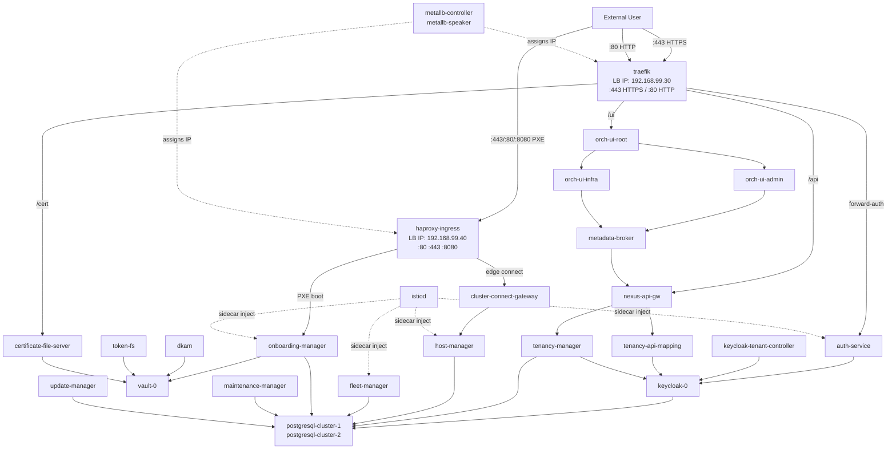
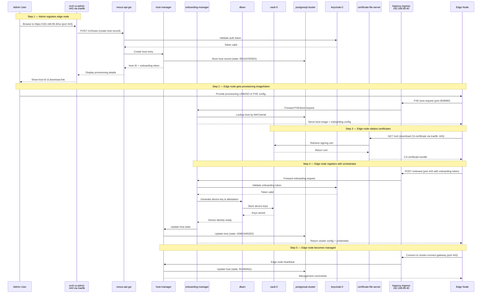

# EMF Orchestration — External Access Flow & Pod Dependencies



---

## Edge Node Onboarding Flow

### How it works (step-by-step)

When an edge node is onboarded to this orchestrator, the following flow occurs:

```
1. Admin creates host in UI
2. Edge node boots via PXE or downloads provisioning image
3. Edge node registers with orchestrator
4. Orchestrator provisions and manages the edge node
```

### Detailed Flow



### Pod Roles in Onboarding

| Pod | Role in Onboarding |
|---|---|
| **orch-ui-admin** | Admin UI to create/manage hosts |
| **nexus-api-gw** | API gateway — routes REST calls to backend services |
| **keycloak-0** | Authenticates admin users and validates onboarding tokens |
| **host-manager** | Manages host lifecycle (REGISTERED → ONBOARDED → RUNNING) |
| **onboarding-manager** | Handles PXE boot, serves provisioning images, processes onboarding requests |
| **dkam** | Device Key & Attestation Manager — generates device identity and keys |
| **vault-0** | Stores device keys and signing certificates |
| **certificate-file-server** | Serves CA certificates to edge nodes |
| **postgresql-cluster** | Persists host records, state, and metadata |
| **haproxy-ingress** | Entry point for edge node traffic (PXE boot, onboarding, cluster connect) |
| **traefik** | Entry point for admin/UI HTTPS traffic |
| **cluster-connect-gateway** | Maintains persistent connection with onboarded edge nodes |

### Network Ports Used

| Entry Point | IP | Ports | Purpose |
|---|---|---|---|
| **traefik** (LoadBalancer) | 192.168.99.30 | 443 (HTTPS), 80 (HTTP redirect) | Admin UI, API, cert downloads |
| **haproxy-ingress** (LoadBalancer) | 192.168.99.40 | 80, 443, 8080 | PXE boot, edge onboarding, cluster connect |

### Host State Machine

```
REGISTERED → ONBOARDED → RUNNING
     ↑            ↓          ↓
     └── FAILED ←─┴── ERROR ←┘
```
