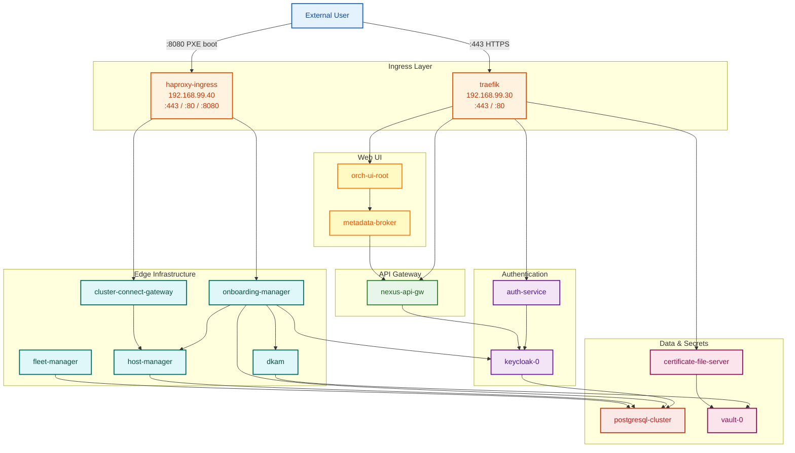

# EMF Orchestration — External Access Flow & Pod Dependencies

---

## Component Details

### Ingress Layer

| Pod | What It Does |
|---|---|
| **traefik** | Reverse proxy and ingress controller for all HTTPS traffic. Terminates TLS on port 443, redirects HTTP :80 to HTTPS. Routes requests to backend services based on URL path (`/ui`, `/api`, `/cert`). Performs forward-auth by calling auth-service before allowing requests through. Exposed via MetalLB LoadBalancer IP `192.168.99.30`. |
| **haproxy-ingress** | Ingress controller dedicated to edge node traffic. Handles PXE boot requests on port 8080, onboarding on port 443, and metadata on port 80. Exposed via MetalLB LoadBalancer IP `192.168.99.40`. Keeps edge traffic separate from admin/UI traffic. |
| **metallb-controller** | Assigns external IP addresses to Kubernetes LoadBalancer services. Watches for services of type LoadBalancer and allocates IPs from configured pools (traefik pool: `192.168.99.30`, haproxy pool: `192.168.99.40`). |
| **metallb-speaker** | DaemonSet that runs on every node. Announces allocated LoadBalancer IPs to the local network using Layer 2 (ARP/NDP) so external clients can reach the cluster services. |

### Authentication & Identity

| Pod | What It Does |
|---|---|
| **auth-service** | Forward-authentication middleware called by traefik on every request. Validates JWT tokens, checks session cookies, and redirects unauthenticated users to Keycloak login. Returns auth headers (user ID, roles, tenant) to downstream services. |
| **keycloak-0** | OpenID Connect identity provider (StatefulSet). Manages user accounts, realms, roles, and client registrations. Issues JWT access tokens and refresh tokens. Provides SSO login page for the admin UI. Stores all identity data in PostgreSQL. |
| **keycloak-tenant-controller** | Watches for new tenants created in the system and automatically provisions corresponding Keycloak realms, clients, and role mappings. Ensures each tenant has isolated authentication configuration. |

### API & Tenancy

| Pod | What It Does |
|---|---|
| **nexus-api-gw** | Central API gateway. Receives all `/api` requests from traefik, applies rate limiting and request validation, then routes to the correct backend microservice based on the API path. Handles API versioning and response aggregation. |
| **tenancy-api-mapping** | Maps API routes to tenant contexts. Ensures each API request is scoped to the correct tenant based on the auth token's tenant claim. Enforces tenant isolation at the API layer. |
| **tenancy-manager** | Manages tenant lifecycle — create, update, delete tenants. Stores tenant configuration in PostgreSQL. Coordinates with keycloak-tenant-controller to provision identity resources for new tenants. |

### Database

| Pod | What It Does |
|---|---|
| **postgresql-cluster** | CloudNativePG-managed PostgreSQL cluster (primary + replica). Central relational database for all platform services. Stores: host records, tenant data, Keycloak identity data, workflow state, and infrastructure metadata. Provides HA with automatic failover. |

### Secrets & Certificates

| Pod | What It Does |
|---|---|
| **vault-0** | HashiCorp Vault (StatefulSet). Centralized secrets management. Stores: device keys, TLS certificates, signing keys, database credentials, and service-to-service tokens. Provides dynamic secret generation and automatic rotation. Accessed by dkam, certificate-file-server, and token-fs. |
| **token-fs** | Token file server. Reads secrets and tokens from Vault and serves them to pods that need bootstrap credentials. Provides a file-system-like interface for secret distribution within the cluster. |
| **certificate-file-server** | Serves CA certificates and trust bundles to edge nodes over HTTPS (via traefik `/cert` route). Edge nodes download the CA cert during onboarding so they can trust the orchestrator's TLS certificates. Retrieves certs from Vault. |

### Infrastructure Management

| Pod | What It Does |
|---|---|
| **host-manager** | Core host lifecycle manager. Tracks every edge node's state (REGISTERED → ONBOARDED → RUNNING → ERROR). Receives heartbeats from connected edge nodes via cluster-connect-gateway. Stores host inventory, hardware details, and health status in PostgreSQL. |
| **fleet-manager** | Manages groups of hosts as fleets. Handles fleet-level operations like rolling updates, policy assignment, and batch configuration changes. Groups hosts by labels, location, or custom criteria. |
| **onboarding-manager** | Handles the full edge node onboarding process. Serves PXE boot images via haproxy, validates onboarding tokens, triggers device key generation (via dkam), and transitions hosts from REGISTERED to ONBOARDED. First contact point for new edge nodes. |
| **dkam** | Device Key & Attestation Manager. Generates unique cryptographic identities for each edge node during onboarding. Performs hardware attestation (TPM-based if available). Stores device keys in Vault. Ensures each edge node has a verifiable identity. |
| **maintenance-manager** | Schedules and executes maintenance windows on edge nodes. Handles operations like OS patching, firmware updates, and service restarts. Coordinates with host-manager to drain workloads before maintenance. |
| **update-manager** | Manages software update lifecycle for edge nodes. Tracks available updates, manages update policies, orchestrates staged rollouts, and handles rollback on failure. Works with fleet-manager for fleet-wide updates. |
| **cluster-connect-gateway** | Maintains persistent gRPC/WebSocket connections with onboarded edge nodes. Acts as the reverse tunnel — edge nodes connect outbound to this gateway, allowing the orchestrator to send commands without requiring inbound access to edge networks. Forwards heartbeats to host-manager. |

### User Interface

| Pod | What It Does |
|---|---|
| **orch-ui-root** | Root web application shell. Serves the main SPA (Single Page Application) that loads micro-frontends (ui-admin, ui-infra) as sub-modules. Handles top-level routing and navigation. |
| **orch-ui-admin** | Admin micro-frontend. Provides UI for tenant management, user management, role assignments, and platform configuration. Communicates with backend via metadata-broker. |
| **orch-ui-infra** | Infrastructure micro-frontend. Provides UI for host management, fleet operations, onboarding, updates, and monitoring dashboards. Communicates with backend via metadata-broker. |
| **metadata-broker** | Backend-for-frontend (BFF) service for the UI pods. Aggregates data from multiple backend APIs (via nexus-api-gw) into UI-friendly responses. Handles WebSocket connections for real-time UI updates. |

### Service Mesh

| Pod | What It Does |
|---|---|
| **istiod** | Istio control plane. Injects Envoy sidecar proxies into pods for mutual TLS (mTLS) between services, traffic management, and observability. Provides service-to-service authentication without application code changes. All inter-pod communication is encrypted via sidecars. |
