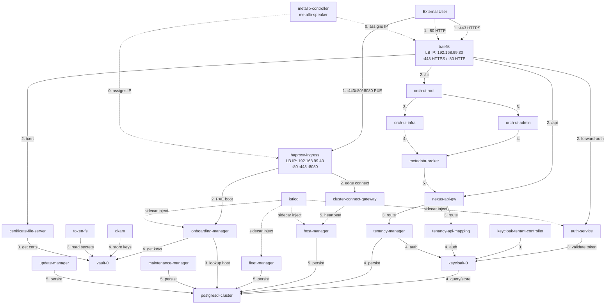

# EMF Orchestration — External Access Flow & Pod Dependencies

```mermaid
graph TD
    %% External User Access
    USER["External User"]

    %% MetalLB Load Balancer
    METALLB["metallb-controller<br/>metallb-speaker"]

    %% Traefik Ingress - Main HTTPS entry
    TRAEFIK["traefik<br/>LB IP: 192.168.99.30<br/>:443 HTTPS / :80 HTTP"]

    %% HAProxy Ingress - PXE boot entry
    HAPROXY["haproxy-ingress<br/>LB IP: 192.168.99.40<br/>:80 :443 :8080"]

    %% Auth & Identity
    AUTH["auth-service"]
    KEYCLOAK["keycloak-0"]
    KC_TENANT["keycloak-tenant-controller"]

    %% Tenancy / IAM
    NEXUS_GW["nexus-api-gw"]
    TEN_API["tenancy-api-mapping"]
    TEN_MGR["tenancy-manager"]

    %% Database
    PG["postgresql-cluster"]

    %% Secrets & Certs
    VAULT["vault-0"]
    TOKEN_FS["token-fs"]
    CERT_FS["certificate-file-server"]

    %% Infra Services
    HOST_MGR["host-manager"]
    FLEET_MGR["fleet-manager"]
    ONB_MGR["onboarding-manager"]
    DKAM["dkam"]
    MAINT_MGR["maintenance-manager"]
    UPDATE_MGR["update-manager"]
    CLUSTER_GW["cluster-connect-gateway"]

    %% UI
    UI_ROOT["orch-ui-root"]
    UI_ADMIN["orch-ui-admin"]
    UI_INFRA["orch-ui-infra"]
    META_BROKER["metadata-broker"]

    %% Service Mesh
    ISTIOD["istiod"]

    %% ─── External Access Flow (numbered) ────────────────────────
    USER -->|"1. :443 HTTPS"| TRAEFIK
    USER -->|"1. :80 HTTP"| TRAEFIK
    USER -->|"1. :443/:80/:8080 PXE"| HAPROXY
    METALLB -.->|"0. assigns IP"| TRAEFIK
    METALLB -.->|"0. assigns IP"| HAPROXY

    %% ─── Traefik routes to services ────────────────────────────
    TRAEFIK -->|"2. forward-auth"| AUTH
    TRAEFIK -->|"2. /ui"| UI_ROOT
    TRAEFIK -->|"2. /api"| NEXUS_GW
    TRAEFIK -->|"2. /cert"| CERT_FS

    %% ─── HAProxy routes ────────────────────────────────────────
    HAPROXY -->|"2. PXE boot"| ONB_MGR
    HAPROXY -->|"2. edge connect"| CLUSTER_GW

    %% ─── Auth & Identity dependencies ──────────────────────────
    AUTH -->|"3. validate token"| KEYCLOAK
    KC_TENANT -->|"3."| KEYCLOAK
    KEYCLOAK -->|"4. query/store"| PG

    %% ─── API Gateway flow ──────────────────────────────────────
    NEXUS_GW -->|"3. route"| TEN_API
    NEXUS_GW -->|"3. route"| TEN_MGR
    TEN_API -->|"4. auth"| KEYCLOAK
    TEN_MGR -->|"4. auth"| KEYCLOAK
    TEN_MGR -->|"4. persist"| PG

    %% ─── Infra pod-to-pod ──────────────────────────────────────
    HOST_MGR -->|"5. persist"| PG
    FLEET_MGR -->|"5. persist"| PG
    ONB_MGR -->|"3. lookup host"| PG
    ONB_MGR -->|"4. get keys"| VAULT
    DKAM -->|"4. store keys"| VAULT
    MAINT_MGR -->|"5. persist"| PG
    UPDATE_MGR -->|"5. persist"| PG
    CLUSTER_GW -->|"5. heartbeat"| HOST_MGR

    %% ─── UI dependencies ───────────────────────────────────────
    UI_ROOT -->|"3."| UI_ADMIN
    UI_ROOT -->|"3."| UI_INFRA
    UI_ADMIN -->|"4."| META_BROKER
    UI_INFRA -->|"4."| META_BROKER
    META_BROKER -->|"5."| NEXUS_GW

    %% ─── Secrets / Token flow ──────────────────────────────────
    TOKEN_FS -->|"3. read secrets"| VAULT
    CERT_FS -->|"3. get certs"| VAULT

    %% ─── Service Mesh sidecar injection ────────────────────────
    ISTIOD -.->|"sidecar inject"| AUTH
    ISTIOD -.->|"sidecar inject"| HOST_MGR
    ISTIOD -.->|"sidecar inject"| FLEET_MGR
    ISTIOD -.->|"sidecar inject"| ONB_MGR
```
