# EMF Orchestration Deployment — Helm Charts, Pods & Dependencies

**Purpose:** SDLE Safe Approval — Deployment architecture, pod connectivity, and dependency mapping.

---

## Deployment Phases Overview

| Phase | Helmfile | Description |
|---|---|---|
| **PRE-ORCH** | `pre-orch/helmfile.yaml.gotmpl` | Storage & Load Balancer foundation |
| **POST-ORCH** | `post-orch/helmfile.yaml.gotmpl` | 50+ Helm releases across 17 deployment waves |

---

## Dependency Tree Diagram

```mermaid
graph TD
    classDef preorch fill:#2196F3,color:#fff,stroke:#1565C0,stroke-width:2px
    classDef wave1 fill:#4CAF50,color:#fff,stroke:#2E7D32,stroke-width:2px
    classDef wave90 fill:#8BC34A,color:#000,stroke:#558B2F,stroke-width:2px
    classDef wave100 fill:#FF9800,color:#fff,stroke:#E65100,stroke-width:2px
    classDef wave110 fill:#FF5722,color:#fff,stroke:#BF360C,stroke-width:2px
    classDef wave130 fill:#9C27B0,color:#fff,stroke:#6A1B9A,stroke-width:2px
    classDef wave150 fill:#E91E63,color:#fff,stroke:#880E4F,stroke-width:2px
    classDef wave160 fill:#795548,color:#fff,stroke:#4E342E,stroke-width:2px
    classDef wave170 fill:#607D8B,color:#fff,stroke:#37474F,stroke-width:2px
    classDef wave1000 fill:#00BCD4,color:#fff,stroke:#006064,stroke-width:2px
    classDef wave1100 fill:#009688,color:#fff,stroke:#004D40,stroke-width:2px
    classDef wave1200 fill:#CDDC39,color:#000,stroke:#9E9D24,stroke-width:2px
    classDef wave2000 fill:#3F51B5,color:#fff,stroke:#1A237E,stroke-width:2px
    classDef wave3000 fill:#F44336,color:#fff,stroke:#B71C1C,stroke-width:2px

    %% =====================================================================
    %% PRE-ORCH DEPLOYMENT (helmfile: pre-orch/helmfile.yaml.gotmpl)
    %% =====================================================================
    subgraph PRE["PRE-ORCH DEPLOYMENT -- pre-orch helmfile"]
        direction TB
        subgraph NS_OPENEBS["Namespace: openebs-system"]
            OPENEBS["openebs-localpv<br/><i>Chart: localpv-provisioner v4.3.0</i><br/>Pod: openebs-localpv-provisioner"]
        end
        subgraph NS_METALLB["Namespace: metallb-system"]
            METALLB["metallb<br/><i>Chart: metallb v0.15.2</i><br/>Pod: metallb-controller<br/>Pod: metallb-speaker DaemonSet"]
            METALLB_CFG["metallb-config<br/><i>Chart: metallb-config</i><br/>IPAddressPool + L2Advertisement"]
        end
        METALLB --> METALLB_CFG
    end
    OPENEBS:::preorch
    METALLB:::preorch
    METALLB_CFG:::preorch

    %% =====================================================================
    %% POST-ORCH DEPLOYMENT (helmfile: post-orch/helmfile.yaml.gotmpl)
    %% =====================================================================
    PRE --> POST

    subgraph POST["POST-ORCH DEPLOYMENT -- post-orch helmfile"]
        direction TB

        %% Wave 1: Operators
        subgraph W1["Wave 1 -- Operators"]
            KC_OP["keycloak-operator<br/><i>NS: orch-platform</i><br/>Pod: keycloak-operator"]
            PG_OP["postgresql-operator<br/><i>NS: postgresql-operator</i><br/>Pod: cloudnative-pg"]
        end

        %% Wave 90: Namespace Labels
        subgraph W90["Wave 90 -- Namespace Labels"]
            NS_LABEL["namespace-label<br/><i>NS: ns-label</i><br/>Job: ns-label"]
        end
        KC_OP --> NS_LABEL
        PG_OP --> NS_LABEL

        %% Wave 100: Core Infra
        subgraph W100["Wave 100 -- Core Infrastructure"]
            CERT_MGR["cert-manager<br/><i>NS: cert-manager</i><br/>Pod: cert-manager<br/>Pod: cert-manager-webhook<br/>Pod: cert-manager-cainjector"]
            EXT_SEC["external-secrets<br/><i>NS: orch-secret</i><br/>Pod: external-secrets<br/>Pod: external-secrets-webhook"]
            ISTIO_B["istio-base<br/><i>NS: istio-system</i><br/>CRDs only"]
            METRICS["k8s-metrics-server<br/><i>NS: kube-system</i><br/>Pod: metrics-server"]
            KYVERNO["kyverno<br/><i>NS: kyverno</i><br/>Pod: kyverno-admission<br/>Pod: kyverno-background<br/>Pod: kyverno-reports"]
        end
        NS_LABEL --> CERT_MGR
        NS_LABEL --> EXT_SEC
        NS_LABEL --> ISTIO_B
        NS_LABEL --> METRICS
        NS_LABEL --> KYVERNO

        %% Wave 105: Kyverno Policies
        KYVERNO_POL["kyverno-extra-policies<br/><i>NS: kyverno</i>"]
        CERT_MGR --> KYVERNO_POL

        %% Wave 110: Istio + Reloader
        subgraph W110["Wave 110 -- Service Mesh and Reloader"]
            ISTIOD["istiod<br/><i>NS: istio-system</i><br/>Pod: istiod"]
            RELOADER["reloader<br/><i>NS: orch-platform</i><br/>Pod: reloader"]
        end
        ISTIO_B --> ISTIOD
        NS_LABEL --> RELOADER

        %% Wave 115: Wait Istio
        WAIT_ISTIO["wait-istio-job<br/><i>NS: ns-label</i><br/>Job: wait-istio"]
        ISTIOD --> WAIT_ISTIO
        RELOADER --> WAIT_ISTIO

        %% Wave 130: PG Secrets
        PG_SEC["postgresql-secrets<br/><i>NS: orch-database</i><br/>Secrets + hook: sync-db-passwords"]
        WAIT_ISTIO --> PG_SEC

        %% Wave 140: PG Cluster
        PG_CLUSTER["postgresql-cluster<br/><i>NS: orch-database</i><br/>Pod: postgresql-cluster-1 primary<br/>Pod: postgresql-cluster-2 replica"]
        PG_SEC --> PG_CLUSTER

        %% Wave 150: Keycloak + Certs + Istio Policy
        subgraph W150["Wave 150 -- Identity and Policy"]
            ISTIO_POL["istio-policy<br/><i>NS: istio-system</i><br/>AuthorizationPolicy"]
            KIALI["kiali<br/><i>NS: istio-system</i><br/>Pod: kiali"]
            AUTOCERT["platform-autocert<br/><i>NS: cert-manager</i><br/>ClusterIssuer"]
            KEYCLOAK["platform-keycloak<br/><i>NS: orch-platform</i><br/>Pod: keycloak-0 StatefulSet<br/>KeycloakRealm"]
        end
        PG_CLUSTER --> ISTIO_POL
        PG_CLUSTER --> KIALI
        PG_CLUSTER --> AUTOCERT
        PG_CLUSTER --> KEYCLOAK

        %% Wave 160: Vault + Self-signed cert
        subgraph W160["Wave 160 -- Secrets Management"]
            VAULT["vault<br/><i>NS: orch-platform</i><br/>Pod: vault-0 StatefulSet"]
            SELF_CERT["self-signed-cert<br/><i>NS: cert-manager</i><br/>Certificate"]
        end
        AUTOCERT --> VAULT
        KEYCLOAK --> VAULT
        AUTOCERT --> SELF_CERT
        KEYCLOAK --> SELF_CERT

        %% Wave 165: Secrets Config
        SEC_CFG["secrets-config<br/><i>NS: orch-platform</i><br/>SecretStore + hook: cleanup-vault-keys"]
        VAULT --> SEC_CFG

        %% Wave 170: RS Proxy + TLS Wait
        subgraph W170["Wave 170 -- Registry and TLS"]
            RS_PROXY["rs-proxy<br/><i>NS: orch-platform</i><br/>Pod: rs-proxy"]
            TLS_ORCH["secret-wait-tls-orch<br/><i>NS: orch-gateway</i><br/>Job: wait-tls-orch"]
        end
        SEC_CFG --> RS_PROXY
        SEC_CFG --> TLS_ORCH
        SELF_CERT --> TLS_ORCH

        %% Wave 180: Copy Secrets
        subgraph W180["Wave 180 -- Secret Distribution"]
            COPY_GW_CATTLE["copy-ca-cert gw to cattle<br/><i>NS: cattle-system</i>"]
            COPY_GW_INFRA["copy-ca-cert gw to infra<br/><i>NS: orch-infra</i>"]
            COPY_KC_INFRA["copy-keycloak-admin to infra<br/><i>NS: orch-infra</i>"]
        end
        RS_PROXY --> COPY_GW_CATTLE
        TLS_ORCH --> COPY_GW_CATTLE
        RS_PROXY --> COPY_GW_INFRA
        TLS_ORCH --> COPY_GW_INFRA
        RS_PROXY --> COPY_KC_INFRA
        TLS_ORCH --> COPY_KC_INFRA

        %% Wave 1000: Traefik Pre
        TRAEFIK_PRE["traefik-pre<br/><i>NS: orch-gateway</i><br/>Middleware + TLSOption"]
        COPY_GW_CATTLE --> TRAEFIK_PRE
        COPY_GW_INFRA --> TRAEFIK_PRE
        COPY_KC_INFRA --> TRAEFIK_PRE

        %% Wave 1100: Ingress
        subgraph W1100["Wave 1100 -- Ingress Layer"]
            HAPROXY["ingress-haproxy<br/><i>NS: orch-boots</i><br/>Pod: haproxy-ingress"]
            KYV_ISTIO["kyverno-istio-policy<br/><i>NS: kyverno</i>"]
            KYV_TRAEFIK["kyverno-traefik-policy<br/><i>NS: kyverno</i>"]
            TRAEFIK["traefik<br/><i>NS: orch-gateway</i><br/>Pod: traefik Deployment<br/>Service: LoadBalancer"]
        end
        TRAEFIK_PRE --> HAPROXY
        TRAEFIK_PRE --> KYV_ISTIO
        TRAEFIK_PRE --> KYV_TRAEFIK
        TRAEFIK_PRE --> TRAEFIK

        %% Wave 1200: App Routing
        subgraph W1200["Wave 1200 -- Routing and Tenancy Data"]
            HAPROXY_PXE["haproxy-ingress-pxe-boots<br/><i>NS: orch-boots</i><br/>Ingress routes"]
            TENANCY_DM["tenancy-datamodel<br/><i>NS: orch-iam</i><br/>Job: tenancy-datamodel"]
            TRAEFIK_EXTRA["traefik-extra-objects<br/><i>NS: orch-gateway</i><br/>IngressRoute + Middleware"]
        end
        HAPROXY --> HAPROXY_PXE
        KYV_ISTIO --> HAPROXY_PXE
        KYV_TRAEFIK --> HAPROXY_PXE
        TRAEFIK --> HAPROXY_PXE
        HAPROXY --> TENANCY_DM
        TRAEFIK --> TENANCY_DM
        HAPROXY --> TRAEFIK_EXTRA
        TRAEFIK --> TRAEFIK_EXTRA

        %% Wave 1210: Tenancy Services
        subgraph W1210["Wave 1210 -- Tenancy Management"]
            TEN_API["tenancy-api-mapping<br/><i>NS: orch-iam</i><br/>Pod: tenancy-api-mapping"]
            TEN_MGR["tenancy-manager<br/><i>NS: orch-iam</i><br/>Pod: tenancy-manager"]
        end
        HAPROXY_PXE --> TEN_API
        TENANCY_DM --> TEN_API
        TRAEFIK_EXTRA --> TEN_API
        HAPROXY_PXE --> TEN_MGR
        TENANCY_DM --> TEN_MGR
        TRAEFIK_EXTRA --> TEN_MGR

        %% Wave 1220: Nexus API GW
        NEXUS_GW["nexus-api-gw<br/><i>NS: orch-iam</i><br/>Pod: nexus-api-gw"]
        TEN_API --> NEXUS_GW
        TEN_MGR --> NEXUS_GW

        %% Wave 1250: KC Tenant Controller
        KC_TENANT["keycloak-tenant-controller<br/><i>NS: orch-gateway</i><br/>Pod: keycloak-tenant-controller"]
        NEXUS_GW --> KC_TENANT

        %% Wave 1300: Init + TLS + Token
        subgraph W1300["Wave 1300 -- Init and Tokens"]
            TEN_INIT["tenancy-init<br/><i>NS: orch-iam</i><br/>Job: tenancy-init"]
            TLS_BOOTS["secret-wait-tls-boots<br/><i>NS: orch-boots</i><br/>Job: wait-tls-boots"]
            TOKEN_FS["token-fs<br/><i>NS: orch-secret</i><br/>Pod: token-fs"]
        end
        KC_TENANT --> TEN_INIT
        KC_TENANT --> TLS_BOOTS
        HAPROXY_PXE --> TLS_BOOTS
        KC_TENANT --> TOKEN_FS

        %% Wave 1400: Copy Boot Certs
        subgraph W1400["Wave 1400 -- Boot Cert Distribution"]
            COPY_BOOTS_GW["copy-ca-cert boots to gw<br/><i>NS: orch-gateway</i>"]
            COPY_BOOTS_INFRA["copy-ca-cert boots to infra<br/><i>NS: orch-infra</i>"]
        end
        TLS_BOOTS --> COPY_BOOTS_GW
        TOKEN_FS --> COPY_BOOTS_GW
        TLS_BOOTS --> COPY_BOOTS_INFRA
        TOKEN_FS --> COPY_BOOTS_INFRA

        %% Wave 2000: Core Services
        subgraph W2000["Wave 2000 -- Core Platform Services"]
            COMP_STATUS["component-status<br/><i>NS: orch-platform</i><br/>Pod: component-status"]
            INFRA_CORE["infra-core<br/><i>NS: orch-infra</i><br/>Pod: host-manager<br/>Pod: fleet-manager"]
            META_BROKER["metadata-broker<br/><i>NS: orch-ui</i><br/>Pod: metadata-broker"]
        end
        COPY_BOOTS_GW --> COMP_STATUS
        COPY_BOOTS_INFRA --> COMP_STATUS
        COPY_BOOTS_GW --> INFRA_CORE
        COPY_BOOTS_INFRA --> INFRA_CORE
        COPY_BOOTS_GW --> META_BROKER
        COPY_BOOTS_INFRA --> META_BROKER

        %% Wave 2005: Auth Service
        AUTH_SVC["auth-service<br/><i>NS: orch-gateway</i><br/>Pod: auth-service"]
        COMP_STATUS --> AUTH_SVC
        INFRA_CORE --> AUTH_SVC
        META_BROKER --> AUTH_SVC

        %% Wave 2100: Infra Services
        subgraph W2100["Wave 2100 -- Edge Infrastructure"]
            INFRA_ONB["infra-onboarding<br/><i>NS: orch-infra</i><br/>Pod: onboarding-manager<br/>Pod: dkam"]
            INFRA_EXT["infra-external<br/><i>NS: orch-infra</i><br/>Pod: cluster-connect-gateway"]
            INFRA_MGR["infra-managers<br/><i>NS: orch-infra</i><br/>Pod: maintenance-manager<br/>Pod: update-manager"]
        end
        AUTH_SVC --> INFRA_ONB
        AUTH_SVC --> INFRA_EXT
        AUTH_SVC --> INFRA_MGR

        %% Wave 3000: UI + Cert Server
        subgraph W3000["Wave 3000 -- Web UI and Certificate Server"]
            CERT_FS["certificate-file-server<br/><i>NS: orch-gateway</i><br/>Pod: certificate-file-server"]
            UI_ADMIN["web-ui-admin<br/><i>NS: orch-ui</i><br/>Pod: orch-ui-admin"]
            UI_INFRA["web-ui-infra<br/><i>NS: orch-ui</i><br/>Pod: orch-ui-infra"]
        end
        INFRA_ONB --> CERT_FS
        INFRA_EXT --> CERT_FS
        INFRA_MGR --> CERT_FS
        INFRA_ONB --> UI_ADMIN
        INFRA_EXT --> UI_ADMIN
        INFRA_MGR --> UI_ADMIN
        INFRA_ONB --> UI_INFRA
        INFRA_EXT --> UI_INFRA
        INFRA_MGR --> UI_INFRA

        %% Wave 3010: Root UI
        UI_ROOT["web-ui root<br/><i>NS: orch-ui</i><br/>Pod: orch-ui-root"]
        CERT_FS --> UI_ROOT
        UI_ADMIN --> UI_ROOT
        UI_INFRA --> UI_ROOT
    end

    %% Apply wave styles
    KC_OP:::wave1
    PG_OP:::wave1
    NS_LABEL:::wave90
    CERT_MGR:::wave100
    EXT_SEC:::wave100
    ISTIO_B:::wave100
    METRICS:::wave100
    KYVERNO:::wave100
    KYVERNO_POL:::wave100
    ISTIOD:::wave110
    RELOADER:::wave110
    WAIT_ISTIO:::wave110
    PG_SEC:::wave130
    PG_CLUSTER:::wave130
    ISTIO_POL:::wave150
    KIALI:::wave150
    AUTOCERT:::wave150
    KEYCLOAK:::wave150
    VAULT:::wave160
    SELF_CERT:::wave160
    SEC_CFG:::wave160
    RS_PROXY:::wave170
    TLS_ORCH:::wave170
    COPY_GW_CATTLE:::wave170
    COPY_GW_INFRA:::wave170
    COPY_KC_INFRA:::wave170
    TRAEFIK_PRE:::wave1000
    HAPROXY:::wave1100
    KYV_ISTIO:::wave1100
    KYV_TRAEFIK:::wave1100
    TRAEFIK:::wave1100
    HAPROXY_PXE:::wave1200
    TENANCY_DM:::wave1200
    TRAEFIK_EXTRA:::wave1200
    TEN_API:::wave1200
    TEN_MGR:::wave1200
    NEXUS_GW:::wave1200
    KC_TENANT:::wave1200
    TEN_INIT:::wave2000
    TLS_BOOTS:::wave2000
    TOKEN_FS:::wave2000
    COPY_BOOTS_GW:::wave2000
    COPY_BOOTS_INFRA:::wave2000
    COMP_STATUS:::wave2000
    INFRA_CORE:::wave2000
    META_BROKER:::wave2000
    AUTH_SVC:::wave2000
    INFRA_ONB:::wave2000
    INFRA_EXT:::wave2000
    INFRA_MGR:::wave2000
    CERT_FS:::wave3000
    UI_ADMIN:::wave3000
    UI_INFRA:::wave3000
    UI_ROOT:::wave3000
```



---

## Deployment Wave Summary

| Wave | Helm Charts | Namespace(s) | Pods / Resources |
|---|---|---|---|
| **PRE-ORCH** | openebs-localpv, metallb, metallb-config | openebs-system, metallb-system | openebs-localpv-provisioner, metallb-controller, metallb-speaker (DS) |
| **1** | keycloak-operator, postgresql-operator | orch-platform, postgresql-operator | keycloak-operator, cloudnative-pg |
| **90** | namespace-label | ns-label | Job: ns-label |
| **100** | cert-manager, external-secrets, istio-base, k8s-metrics-server, kyverno | cert-manager, orch-secret, istio-system, kube-system, kyverno | cert-manager + webhook + cainjector, external-secrets + webhook, metrics-server, kyverno-admission + background + reports |
| **105** | kyverno-extra-policies | kyverno | ClusterPolicy resources |
| **110** | istiod, reloader | istio-system, orch-platform | istiod, reloader |
| **115** | wait-istio-job | ns-label | Job: wait-istio |
| **130** | postgresql-secrets | orch-database | Secrets + hook: sync-db-passwords |
| **140** | postgresql-cluster | orch-database | postgresql-cluster-1 (primary), postgresql-cluster-2 (replica) |
| **150** | istio-policy, kiali, platform-autocert, platform-keycloak | istio-system, cert-manager, orch-platform | AuthorizationPolicy, kiali, ClusterIssuer, keycloak-0 (StatefulSet) |
| **160** | vault, self-signed-cert | orch-platform, cert-manager | vault-0 (StatefulSet), Certificate |
| **165** | secrets-config | orch-platform | SecretStore + hook: cleanup-vault-keys |
| **170** | rs-proxy, secret-wait-tls-orch | orch-platform, orch-gateway | rs-proxy, Job: wait-tls-orch |
| **180** | copy-ca-cert (gw→cattle, gw→infra), copy-keycloak-admin→infra | cattle-system, orch-infra | Copy-secret jobs |
| **1000** | traefik-pre | orch-gateway | Middleware + TLSOption |
| **1100** | ingress-haproxy, kyverno-istio-policy, kyverno-traefik-policy, traefik | orch-boots, kyverno, orch-gateway | haproxy-ingress, traefik (LoadBalancer) |
| **1200** | haproxy-ingress-pxe-boots, tenancy-datamodel, traefik-extra-objects | orch-boots, orch-iam, orch-gateway | Ingress routes, Job: tenancy-datamodel, IngressRoute |
| **1210** | tenancy-api-mapping, tenancy-manager | orch-iam | tenancy-api-mapping, tenancy-manager |
| **1220** | nexus-api-gw | orch-iam | nexus-api-gw |
| **1250** | keycloak-tenant-controller | orch-gateway | keycloak-tenant-controller |
| **1300** | tenancy-init, secret-wait-tls-boots, token-fs | orch-iam, orch-boots, orch-secret | Job: tenancy-init, Job: wait-tls-boots, token-fs |
| **1400** | copy-ca-cert (boots→gw, boots→infra) | orch-gateway, orch-infra | Copy-secret jobs |
| **2000** | component-status, infra-core, metadata-broker | orch-platform, orch-infra, orch-ui | component-status, host-manager, fleet-manager, metadata-broker |
| **2005** | auth-service | orch-gateway | auth-service |
| **2100** | infra-onboarding, infra-external, infra-managers | orch-infra | onboarding-manager, dkam, cluster-connect-gateway, maintenance-manager, update-manager |
| **3000** | certificate-file-server, web-ui-admin, web-ui-infra | orch-gateway, orch-ui | certificate-file-server, orch-ui-admin, orch-ui-infra |
| **3010** | web-ui (root) | orch-ui | orch-ui-root |

---

## Key Dependency Chains

### Database Path
```
keycloak-operator + postgresql-operator
  → namespace-label
    → cert-manager
      → istiod → wait-istio-job
        → postgresql-secrets
          → postgresql-cluster
            → platform-keycloak
```

### Ingress Path
```
platform-keycloak + platform-autocert
  → vault → secrets-config
    → rs-proxy + secret-wait-tls-orch
      → copy-secret jobs
        → traefik-pre
          → traefik + ingress-haproxy
```

### Tenancy Path
```
traefik + ingress-haproxy
  → tenancy-datamodel + traefik-extra-objects + haproxy-ingress-pxe-boots
    → tenancy-api-mapping + tenancy-manager
      → nexus-api-gw
        → keycloak-tenant-controller
          → tenancy-init + token-fs + secret-wait-tls-boots
```

### Service Path
```
token-fs + secret-wait-tls-boots
  → copy-ca-cert (boots→gw, boots→infra)
    → component-status + infra-core + metadata-broker
      → auth-service
        → infra-onboarding + infra-external + infra-managers
          → certificate-file-server + web-ui-admin + web-ui-infra
            → web-ui (root)
```

---

## Kubernetes Namespace Map

| Namespace | Components |
|---|---|
| `openebs-system` | openebs-localpv-provisioner |
| `metallb-system` | metallb-controller, metallb-speaker, IPAddressPool |
| `orch-platform` | keycloak-operator, keycloak-0, vault-0, reloader, rs-proxy, secrets-config, component-status |
| `postgresql-operator` | cloudnative-pg controller |
| `orch-database` | postgresql-cluster (primary + replica), postgresql-secrets |
| `cert-manager` | cert-manager, webhook, cainjector, platform-autocert, self-signed-cert |
| `orch-secret` | external-secrets, external-secrets-webhook, token-fs |
| `istio-system` | istio-base (CRDs), istiod, istio-policy, kiali |
| `kube-system` | metrics-server |
| `kyverno` | kyverno-admission, kyverno-background, kyverno-reports, extra-policies, istio-policy, traefik-policy |
| `ns-label` | namespace-label job, wait-istio job |
| `orch-gateway` | traefik, traefik-pre, traefik-extra-objects, secret-wait-tls-orch, auth-service, keycloak-tenant-controller, certificate-file-server, copy-ca-cert-boots→gw |
| `orch-boots` | ingress-haproxy, haproxy-ingress-pxe-boots, secret-wait-tls-boots |
| `orch-iam` | tenancy-datamodel, tenancy-api-mapping, tenancy-manager, nexus-api-gw, tenancy-init |
| `orch-infra` | infra-core (host-manager, fleet-manager), infra-onboarding, infra-external, infra-managers, copy-ca-cert-gw→infra, copy-ca-cert-boots→infra, copy-keycloak-admin→infra |
| `orch-ui` | metadata-broker, orch-ui-root, orch-ui-admin, orch-ui-infra |
| `cattle-system` | copy-ca-cert-gw→cattle |

---

## Source Helmfiles

| File | Purpose |
|---|---|
| `pre-orch/helmfile.yaml.gotmpl` | OpenEBS LocalPV storage + MetalLB load balancer |
| `post-orch/helmfile.yaml.gotmpl` | Full orchestrator stack (operators → infra → UI) |
| `post-orch/environments/onprem-eim-features.yaml.gotmpl` | Feature flags (enable/disable components) |
| `post-orch/environments/onprem-eim-settings.yaml.gotmpl` | Environment-specific settings |
| `post-orch/environments/defaults-disabled.yaml.gotmpl` | Default disabled state for all releases |
