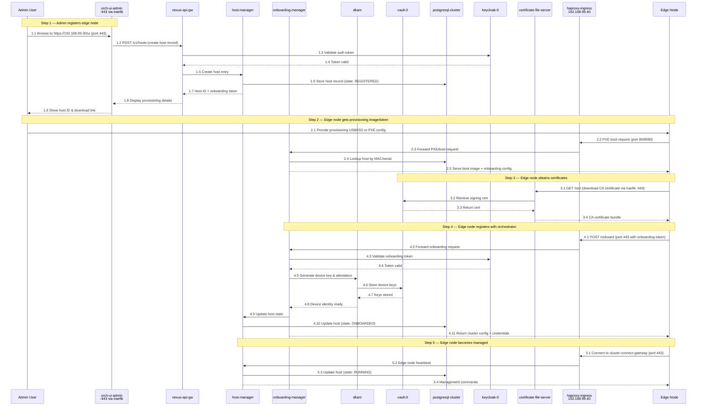
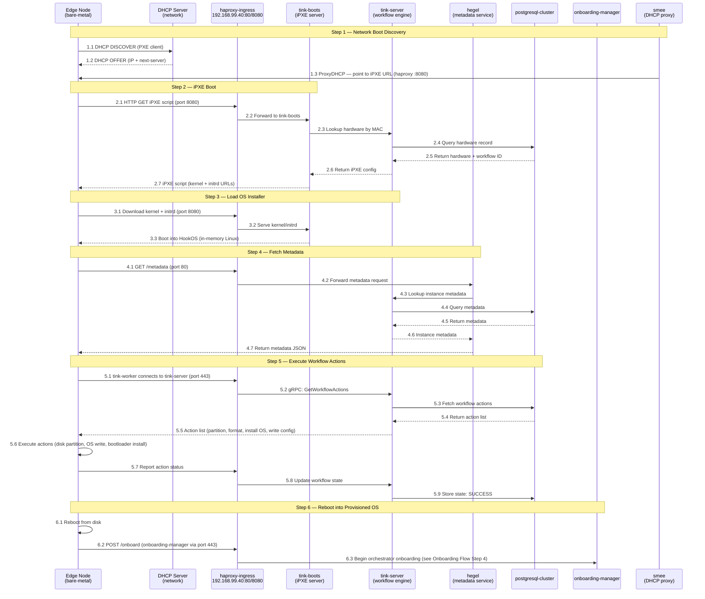
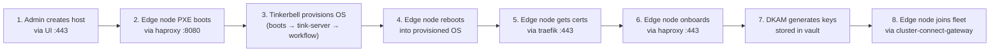

# Edge Node Onboarding Flow

## How it works (step-by-step)

```
1. Admin creates host in UI
2. Edge node boots via PXE (Tinkerbell) or downloads provisioning image
3. Tinkerbell workflows provision the OS on the edge node
4. Edge node registers with orchestrator
5. Orchestrator provisions and manages the edge node
```

---

## Onboarding Flow (Numbered)



---

## Tinkerbell Provisioning Flow (Numbered)

Tinkerbell handles the bare-metal OS provisioning via PXE before the edge node can onboard.



---

## Combined Flow Overview (Numbered)



---

## Pod Roles in Onboarding

| Pod | Role |
|---|---|
| **orch-ui-admin** | Admin UI to create/manage hosts |
| **nexus-api-gw** | API gateway — routes REST calls to backend services |
| **keycloak-0** | Authenticates admin users and validates onboarding tokens |
| **host-manager** | Manages host lifecycle (REGISTERED → ONBOARDED → RUNNING) |
| **onboarding-manager** | Handles PXE boot, serves provisioning images, processes onboarding requests |
| **dkam** | Device Key & Attestation Manager — generates device identity and keys |
| **vault-0** | Stores device keys and signing certificates |
| **certificate-file-server** | Serves CA certificates to edge nodes |
| **postgresql-cluster** | Persists host records, state, and metadata |
| **haproxy-ingress** | Entry point for edge node traffic (PXE boot, onboarding, cluster connect) |
| **traefik** | Entry point for admin/UI HTTPS traffic |
| **cluster-connect-gateway** | Maintains persistent connection with onboarded edge nodes |

### Tinkerbell-Specific Pods

| Pod | Role |
|---|---|
| **smee** | DHCP proxy — directs PXE clients to iPXE boot URL |
| **tink-boots** | iPXE server — serves boot scripts, kernel, and initrd |
| **tink-server** | Workflow engine — manages hardware records and workflow execution |
| **hegel** | Metadata service — provides instance metadata to booting nodes |

---

## Network Ports Used

| Entry Point | IP | Ports | Purpose |
|---|---|---|---|
| **traefik** (LoadBalancer) | 192.168.99.30 | 443 (HTTPS), 80 (HTTP redirect) | Admin UI, API, cert downloads |
| **haproxy-ingress** (LoadBalancer) | 192.168.99.40 | 80 (metadata/TFTP), 443 (onboard/gRPC), 8080 (iPXE/PXE boot) | PXE boot, Tinkerbell, edge onboarding, cluster connect |

---

## Host State Machine

```
REGISTERED → PROVISIONING → ONBOARDED → RUNNING
     ↑            ↓              ↓          ↓
     └── FAILED ←─┴──── ERROR ←──┴── ERROR ←┘
```
